# Add Node.js User Authentication in 10 Minutes!

>
> - Video: [Add Node.js User Authentication in 10 Minutes!](https://www.youtube.com/watch?v=QQwo4E_B0y8)
> - Canal: [Auth0](https://www.youtube.com/channel/UCUlQ5VoIzE_kFbYjzUwHTKA)
> - Fecha: 28 Octubre 2020
> - Duración: 11:44
>

En este video vamos a ver la librería **[express-openid-connect](https://github.com/auth0/express-openid-connect)** la cual nos va a ser especialmente útil para utilizar OpenID como sistema de autenticación dentro de nuestras aplicaciones express. Así gracias a ella nos va a ser sencillo añadir capacidades de autenticación durante el proceso de login, logout y en cualquier otras partes que lo vayamos a necesitar.

---
**Nota:** Pese a que nuestro ejemplo lo vamos a desarrollar utilizando Auth0 como proveedor de la atutentificación tenemos que entender que los procesos que vamos a describir servirían para cualquier otro proveedor de autentificación siempre y cuando se basen en el estándar OpenId.

---

Para ver cómo funciona lo que vamos a hacer es crear un nuevo proyecto de ejemplo e instalar una serie de librarías con las que vamos a trabajar. Lo primero que haremos será establecer que vamos a crear una nueva aplicación de Node.js:

```bash
$ npm init -y
```

Hecho esto el siguiente paso que vamos a dar es instalar todas aquellas librerías que son necesarias para lograr nuestro propósito:

```bash
$ npm install express express-openid-connect dotenv
  + dotenv@8.2.0
  + express@4.17.1
  + express-openid-connect@2.1.0
  [...]
```

Con ello ya tenemos instalado en nuestro proyecto **express** (que actuará como framework para crear nuestra aplicación), **express-openid-connect** (librería que vamos a estudiar a continuación) y **dotenv** (librería que va a permitir establecer y leer variables de entorno de forma sencilla).

Gracias a **dotenv** vamos a poder establecer una serie de variables de entorno que posteriormente utilizaremos dentro de nuestra aplicación. Pero antes de nada vamos a tener que establecer una serie de pasos dentro de Auth0 para poder continuar con nuestro proceso.

---
**Nota:** Auth0 va a ser el servicio que funcionará como nuestro Authorization Server dentro de la aplicación que vamos a crear y por lo tanto será el encargado de realizar todo el proceso de autentificación por nosotros facilitándonos enórmemente el trabajo.

---

Por lo tanto son dos los pasos que vamos a tener que seguir para poder completar nuestro proceso de autentificación utilizando Auth0 y Node:

1. Realizar la configuración de Auth0.
2. Escribir el código de Express que utilice dicha configuración.

## Auth0 Setup.

En primer lugar tenemos que entrar en nuestra cuenta de Auth0 https://auth0.com/ y dentro de la misma acceder en el menú de la izquierda a la opción *Applications*

<div style='text-align: center'>
  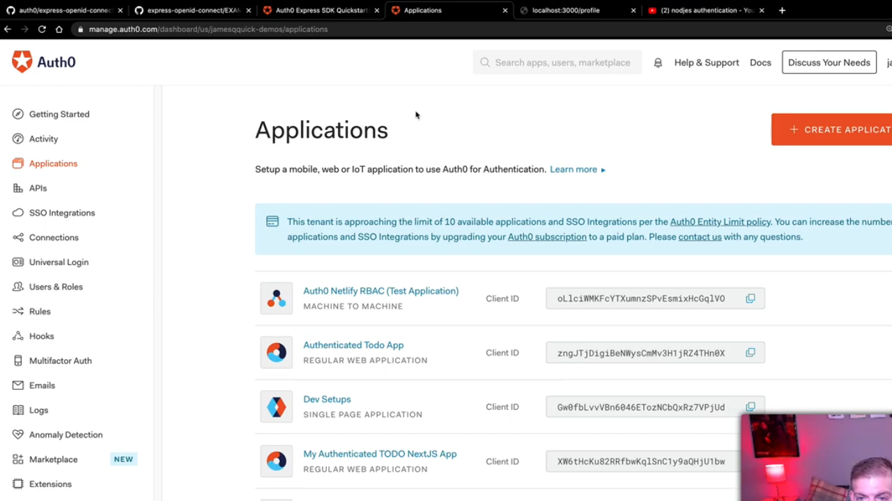
</div>
<br />

Una vez dentro de esta opción pulsaremos sobre el botón *Create Application* con lo que se nos abrirá un cuadro de diálogo parecido al que se muestra a continuación

<div style='text-align: center'>
  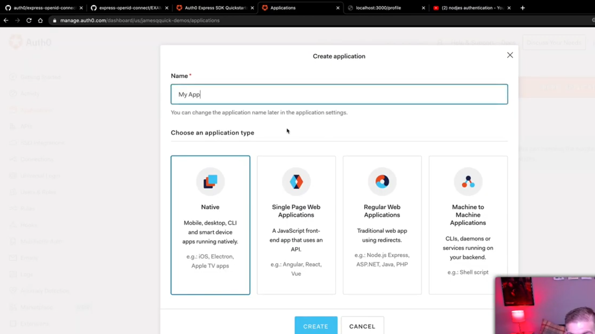
</div>
<br />

Simplemente aquí tendremos que especificar el nombre con el que queremos identificar a nuestra aplicación (cualquiera que no haya sido utilizado anteriormente por alguna de las aplicaciones que tenemos registradas dentro de Auth0) además de tener que indicarle el tipo de aplicación con el que vamos a trabajar (en nuestro caso una aplicación en Node). Elegimos por lo tanto:

<div style='text-align: center'>
  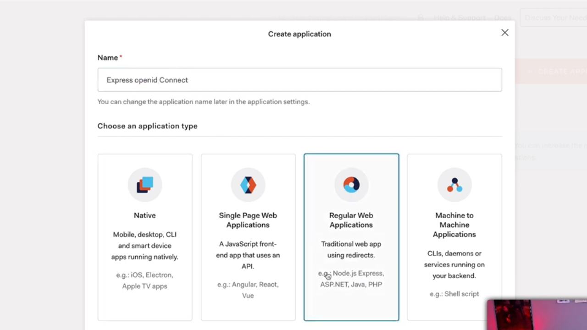
</div>
<br />

Una vez finaliza el proceso de creación de nuestra aplicación Auth0 nos lleva a una página en la que mediante un *wizard* nos va a seguir ayudando a configurar nuestra aplicación dentro del Auth0.

<div style='text-align: center'>
  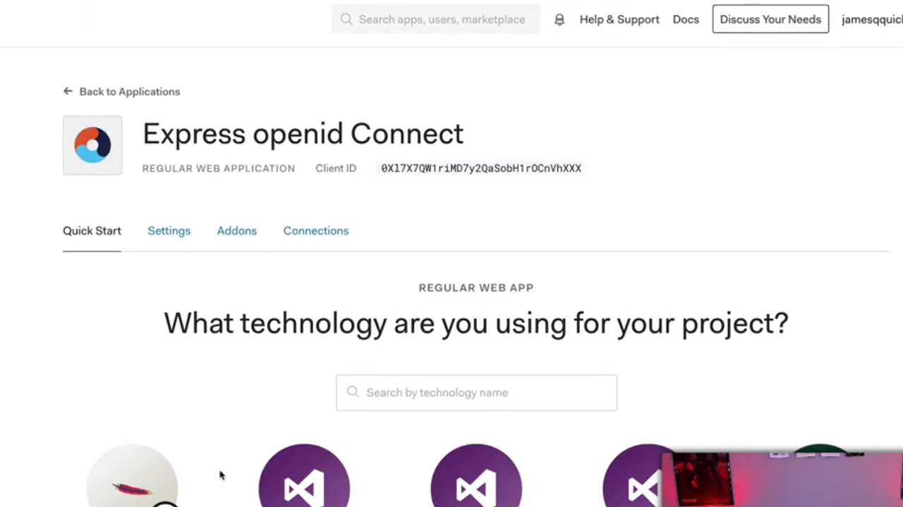
</div>
<br />

A partir de este punto si pulsamos sobre la opción *Node.js (Express)* el wizard continuaría con los pasos que nos permitirán configurar nuestra aplicación de Node dentro de Auth0. En nuestro caso no vamos a tener que preocuparnos por ello pero lo que sí que nos interesará mantener a mano es toda la información que está contenida en la pestaña *Settings* ya que la vamos a a tener que utilizar posteriormente.

Si nos vamos a los pasos que se describen en la documentación de Auth0 relativos a la integración de una aplicación de Node https://auth0.com/docs/quickstart/webapp/express vemos que en el primero de ellos se nos está indicando que tenemos que indicar cuál es la url que realiza las funciones de callback (en otras palabras la url a la que ha de redireccionar Auth0 cuando el proceso de autentificación ha finalizado correctamente):

<div style='text-align: center'>
  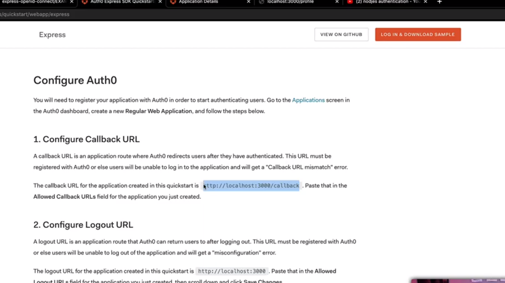
</div>
<br />

¿Qué implica esto? Pues que dentro de la pestaña *Settings* que hemos mostrado anteriormente en el formulario que se nos está mostrando entre otras cosas se está pidiendo lo que se conoce como *Allowed Callback URLs* que, si nos fijamos, de principio nos muestra un cuadro de texto que está completamente vacío. Lo que vamos a hacer es introducir el callback que nos proporciona la documentación de ayuda como la url a que se ha de llamar:

<div style='text-align: center'>
  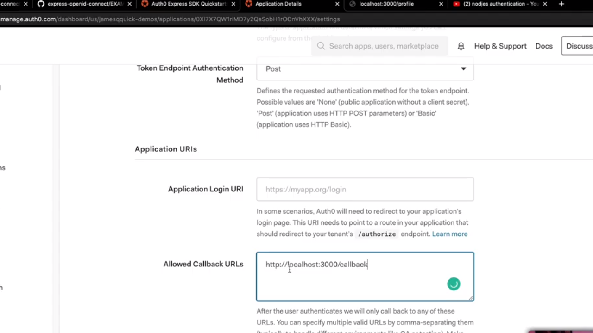
</div>
<br />

---
**Nota:** en este ejemplo la url indica como servidor *localhost* ya que se estará ejecutando en nuestra máquina de forma local y el puerto al que se llamará será el 3000.

---

Otro de los aspectos que tenemos que configurar tiene que ver con el conjunto de las urls a las que estará permitido llamar una vez finaliza el proceso de logout dentro de Auth0. En nuestro caso vamos a simplificar las cosas haciendo que siempre se llama a la página principal de nuestra aplicación por lo que en el campo *Allowed Logout URLs* escribiremos algo como lo siguiente:

<div style='text-align: center'>
  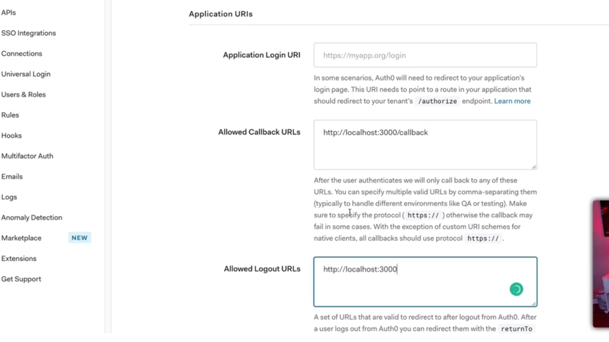
</div>
<br />

El siguiente paso que tendremos que dar será irnos simplemente al final del formulario para poder guardar todos los cambios que hemos efectuado:

<div style='text-align: center'>
  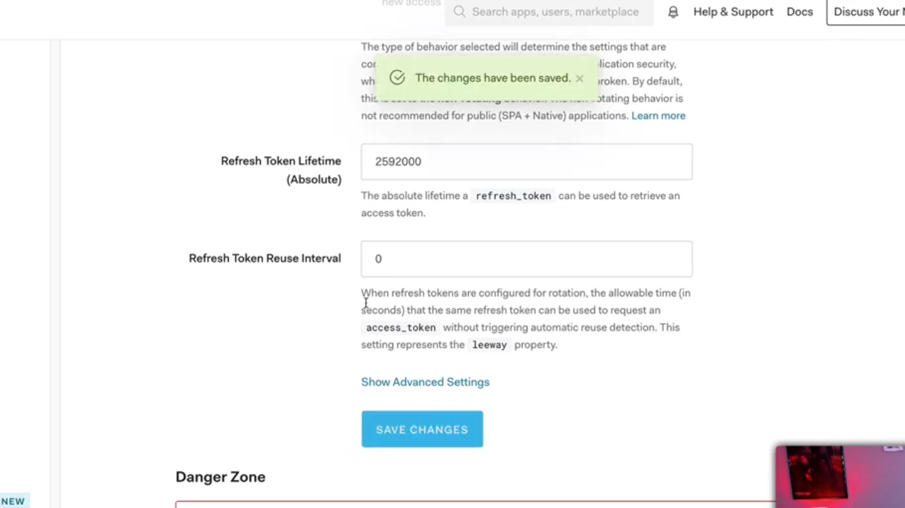
</div>
<br />

Hecho todo esto vamos a recordar cómo será la secuencia de pasos que se van a llevar a cabo cuando un usuario de nuestra aplicación va a intentar hacer login dentro de nuetra aplicación:

1. En primer lugar nuestra aplicación derivará todo el proceso de autentificación a Auth0 que es quien realmente hará toda la autentificación.

2. En caso de que todo el proceso se haya efectuado de forma correcta Auth0 lo que hará será enviar una petición de redirección a la aplicación a la url que ha sido establecida como callback ya que podemos estar seguros que a partir de este punto el usuario va a a estar atentificado.

## Express Setup.

Una vez realizado todo el proceso de configuración de nuestras aplicación en Auth0 vamos a continuar con el proceso de autentificación en Express. Lo primero que haremos será crear un nuevo fichero dentro de nuestro proyecto que será el que contendrá a la aplicación `app.js`.

Los primeros pasos que seguimos son los habituales a la hora de trabajar con Express y es que importaremos la librería para posteriormente crear la aplicación mediante las siguiente instrucciones:

```js
const express = require('express')
const app = express()
```

Ahora vamos a recoger algunas de las opciones de configuración para nuestra aplicación. Lo primero que hacemos es recoger la información del puerto en el que escuchará las peticiones http de tal manera que si está recogido como una variable de entorno de ejecución que denominamos `PORT` se recogerá su valor y en el caso de que no sea así se establecerá el valor por defecto de 3000:

```js
const port = process.env.PORT || 3000
```

Y el siguiente paso que daremos simplemente consistirá en indicar que queremos que nuestra aplicación Express ha de escuchar en dicho puerpo y una vez que se inicializa escribiremos por la consola un mensaje indicando que la aplicación ha inicializado correctamente. Para lograrlo simplemente invocamos al método `listen` que nos ofrece el objeto que representa a la aplicación Express:

```js
app.listen(port, () => {
  console.log(`listening on port ${ port }`)
})
```

Si en este punto queremos testear que todo está funcionando de forma correcta lo que tendremos que hacer es guardar nuestro trabajo y desde la consola del sistema ejecutaremos algo como lo siguiente:

```bash
$ node app.js
  listening on port 3000
```

Lo siguiente que vamos a hacer es importar dentro del código de nuestra aplicación la libreía **dotenv** mediante una invocación a la función `require` de Node. Como resultado de esta llamada se estará devolviendo un objeto propio de la librería que nos ofrece el método `config` el cual, al ser llamado, lo que viene a hacer en su configuración más básica es buscar el archivo `.env` dentro de nuestra aplicación, leerlo y establecer todos los valores que ahí dentro se encuentran como variables de entorno para la ejecución de la aplicación. Así pues escribiremos lo siguiente:

```js
require('dotenv').config()
const express = require('express')
// ...
```

Si ahora nos vamos al [repositorio en GitHub](https://github.com/auth0/express-openid-connect) de la librería dentro del archivo `README.md ` en la sección *Getting Started* se está haciendo referencia a cuatro valores que ha de ser establecidos como variables de entorno.

<div style='text-align: center'>
  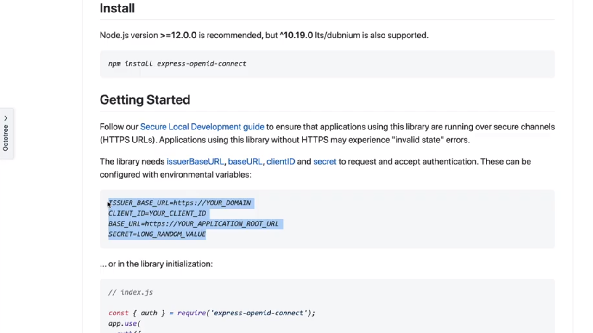
</div>
<br />

Así pues lo que vamos a hacer es crear el fichero `.env` en la raíz de nuestra aplicación y copiar estas cuatro propiedades como el contenido que lo forma:

```ini
ISSUER_BASE_URL=https://YOUR_DOMAIN
CLIENT_ID=YOUR_CLIENT_ID
BASE_URL=https://YOUR_APPLICATION_ROOT_URL
SECRET=LONG_RANDOM_VALUE
```

Ahora tenemos que entender qué valores tenemos que asignar a cada uno de estas propiedades para que el sistema quede perfectamente configurado. El primero de ellos es `ISSUER_BASE_URL` que no es más que la url de nuestra aplicación pero dentro de Auth0. ¿De dónde sacamos esta información? Pues si nos vamos a Auth0 y nos vamos a la información de nuestra aplicación. Para ello accedemos al la opción del menú *Applications* y dentro de la misma seleccionamos la aplicación con la que estamos trabajando.

Una vez se nos carga la información de dicha aplicación tenemos que ir a la pestaña *Settings* y dentro del grupo de campos *Basic Information* nos fijaremos en la opción *Domain* que es donde se establece cuál es la url de nuestra aplicación dentro de Auth0.

<div style='text-align: center'>
  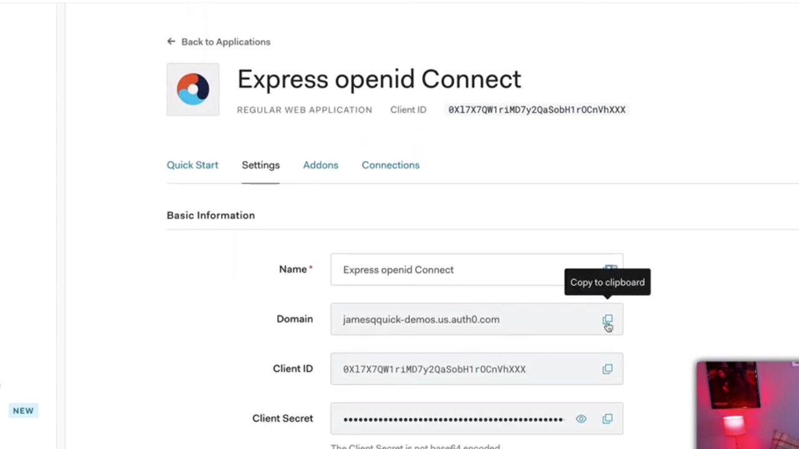
</div>
<br />

Simplemente tenemos que copiar el valor de este campo en el clipboard y establecerlo como el valor que se le asignará a la variable de entorno `ISSUER_BASE_URL` dentro de nuestro fichero `.env`:

```ini
ISSUER_BASE_URL=https://jamesquick-demos.us.auth0.com
CLIENT_ID=YOUR_CLIENT_ID
BASE_URL=https://YOUR_APPLICATION_ROOT_URL
SECRET=LONG_RANDOM_VALUE
```

--
**Nota:** la url que nos proporciona Auth0 como el dominio de nuestra aplicación no viene precedida del protocolo https. En el fichero `.env` en imprescindible que dicha url esté establecida junto con el protocolo que se utilizará para realizar al comunicación.

---

La siguiente propiedad para la que tenemos que establecer el valor es `CLIENT_ID` y el valor que tendremos que proporcionarle es exactamente el mismo que está también regido dentro de los *Settings* de la aplicación en Auth0 más concretamente en el campo *Client ID* dentro del grupo de información *Basic Information* por lo que simplemente la copiamos en el portapapeles:

<div style='text-align: center'>
  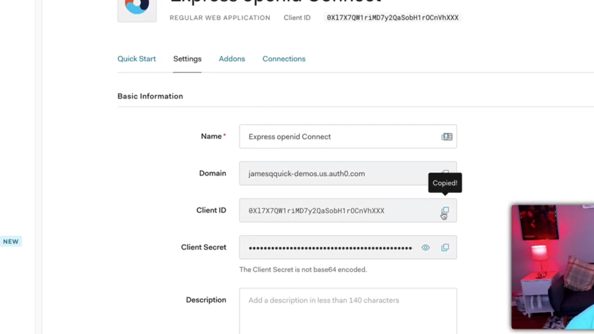
</div>
<br />

Ahora el siguiente paso será copiar esta información en el valor que se le asignará a `CLIENT_ID` en el fichero `.env`:

```ini
ISSUER_BASE_URL=https://jamesquick-demos.us.auth0.com
CLIENT_ID=0X17X7QW1ruMD7y2QaSobH1r0CnVhXXX
BASE_URL=https://YOUR_APPLICATION_ROOT_URL
SECRET=LONG_RANDOM_VALUE
```

El siguiente paso consiste en definir cuál es la url en la que se está ejecutando nuestra aplicación dentro del campo `BASE_URL`. En este caso se trata de nuestra aplicación (no tiene que ver con Auth0) por lo que simplemente definiremos que la aplicación se ejecuta en nuestra máquina (es decir, localhost) y el protocolo de comunicación que se utilizará no será https como se nos sugiere sino que será http. Por lo tanto escribiremos:

```ini
ISSUER_BASE_URL=https://jamesquick-demos.us.auth0.com
CLIENT_ID=0X17X7QW1ruMD7y2QaSobH1r0CnVhXXX
BASE_URL=http://localhost:3000
SECRET=LONG_RANDOM_VALUE
```

Por último el valor del campo `SECRET` puede ser cualquier cosa que nosotros queramos cumpliando que al menos ha de tener un mínimo de 32 caracteres. En nuestro caso vamos a escribir una cadena de caracteres aleatoria:

```ini
ISSUER_BASE_URL=https://jamesquick-demos.us.auth0.com
CLIENT_ID=0X17X7QW1ruMD7y2QaSobH1r0CnVhXXX
BASE_URL=http://localhost:3000
SECRET=asdasdasdasdasdasdasdasdasdasdasdasfafsasdasdasdasfafasdfgasdfasdf
```

Ahora que ya tenemos definidas todas las opciones de configuración si volvemos a la [documentación de la express-openid-connect](https://github.com/auth0/express-openid-connect) en GitHub se nos indica cómo se han de utilizar todos estos valores a la hora de inicializar nuestra aplicación de Express:

<div style='text-align: center'>
  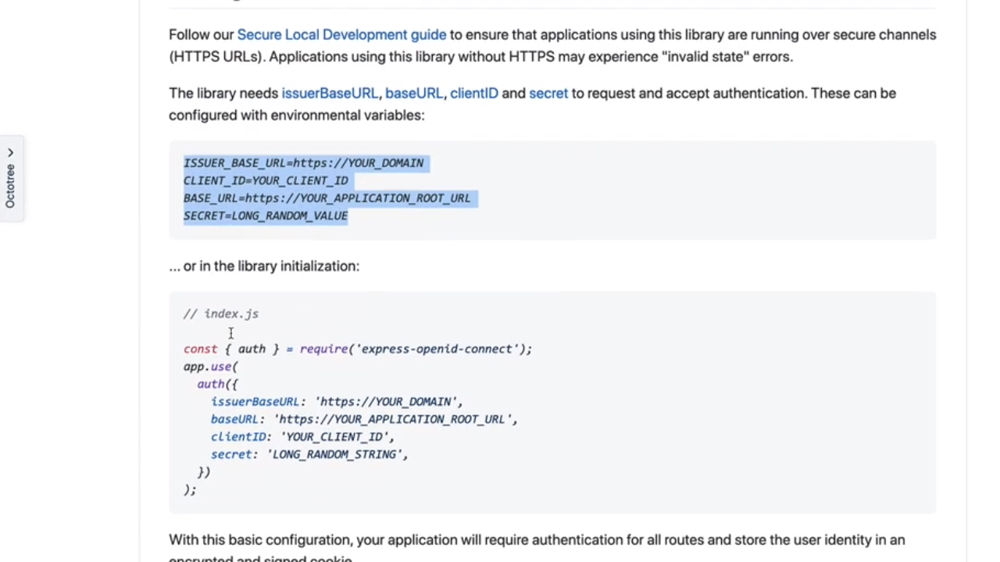
</div>
<br />

Por lo tanto vamos a seguir estos pasos dentro del código de nuestra aplicación. Para ello lo primero que vamos a hacer es importar en el código la función `auth` que nos proporciona la librería **express-openid-connect** mediante una sentencia como la siguiente:

```js
require('dotenv').config()
const express = require('express')
const { auth } = require('express-openid-connect')
// ...
```

Lo que tenemos que entender ahora es que esta función `auth` funciona como un middleware de Express el cual ha de ser configurado como una serie de propiedades para que pueda llevar a cabo su cometido. Así pues tenemos dos factores que hay que entender:

1. Al tratarse de una función que actúa como middleware dentro de nuestra aplicación de Express tenedremos que establecerla como tal llamando al método `use` que está asociado al objeto que representa a la aplicación.

2. La función `auth` va a requerir como parámetro un objeto en el que cada uno de los atributos que lo forman hace referencia a uno de los campos que han sido definidos en el archivo `.env` que hemos construido. Es más, la documentación nos indica qué valores se han de asignar a cada uno de estos atributos.

Así pues no lo siguiente que vamos a hacer esta establecer la función `auth` como middleware dentro de la aplicación escribiendo lo siguiente donde la asignación del valor a cada uno de los atributos que se utilizan en el objeto con la configuración se utilizan a través de las variables de entorno que han sido establecidas con el uso de la librería dotenv:

```js
require('dotenv').config()
const express = require('express')
const { auth } = require('express-openid-connect')

const app = express()
app.use(
  auth({
    issuerBaseURL: process.env.ISSUER_BASE_URL,
    baseURL: process.env.BASE_URL,
    clientID: process.env.CLIENT_ID,
    secret: process.env.SECRET
  })
)
```


---
**Nota:** en esta explicación no vamos a centrarnos en entender qué es el middleware en una aplicación ya que queda fuera del ámbito de la explicación que se está llevando a cabo pero tenemos que verlo como una función que se ejecutará antes de que se lleve a cabo una petición http sobre nuestra aplicación.

---

Vamos a guardar ahora nuestro trabajo de tal manera que si ahora lo volvemos a ejecutar en la consola como hemos visto anteriormente:

```bash
$ node app.js
  listening on port 3000
```

Si desde el navegador vamos a la url de nuestra aplicación pero no a la url principal sino a la que nos va a permitir realizar login dentro del sistema que no es otra que http://localhost:3000/login se nos mostrará algo como lo siguiente:

<div style='text-align: center'>
  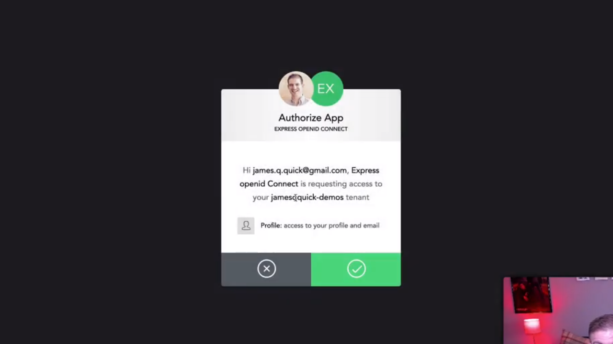
</div>
<br />

donde lo que se nos está haciendo es redireccionar la petición de login al proceso de login de Auth0. En el caso caso de la imagen anterior lo que se muestra es la página a la que se accede una vez que ya nos hemos loggeado en Auth0. De esta manera nosotros como usuarios de la aplicación lo que tenemos que hacer es indicar de forma explícita que queremos que la aplicación a la que estamos accediendo pueda hacer uso de nuestro perfil de Auth0. En el caso de que así sea Auth0 manda una petición de redirección a la url que hemos establecido como callback en la configuración de nuestra aplicación dentro de Auth0 lo que pasa es que ahora mismo nos mostrará un mensaje de error porque no hemos establecido la ruta dentro de la aplicación de Express y así se nos muestra en el navegador:

<div style='text-align: center'>
  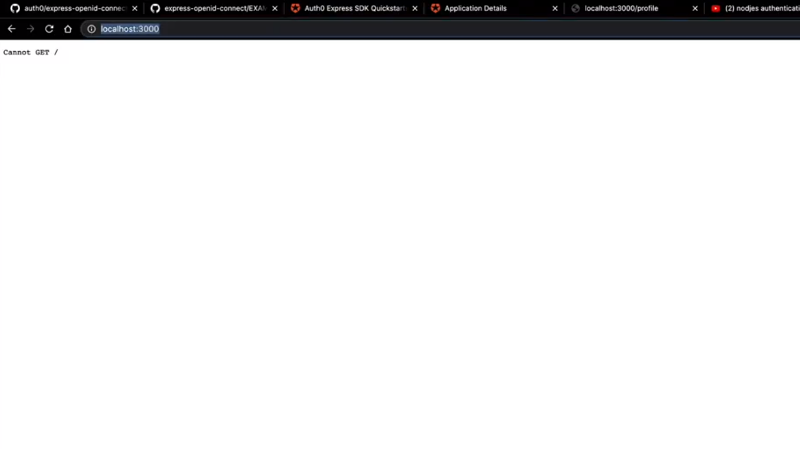
</div>
<br />

---
**Nota:** el path `/login` nos lo proporciona directamente la librería **express-openid-connect** sin que nosotros tengamos que hacer nada al respecto.

---

Vamos por lo tanto a crear dentro de nuestra aplicación de Express la ruta que se encargue de recoger las peticiones de callback. Esta ruta no tiene nada especicial si la comparamos con cualquier otra ruta que podamos definir en una aplicación de Express por lo que únicamente nos tenemos que preocupar por el path de la misma y el método http con el que se llama. Así comenzamos escribiendo:

```js
app.get('/', (req, res) => { })
```

¿Qué es lo que vamos a hacer dentro de esta ruta? Pues lo primero que tenemos que saber es que Auth0 habrá añadido un nuevo objeto dentro del objeto que contiene la información de la respuesta del servidor (el objeto `req`) que se denomina `oidc` (que es la abreviatura de *open id connect*) el cual a su vez tendrá un objeto con una serie de propiedades que nos ayudarán a ver el estado de la comunicación que se ha llevado a cabo. Así, por ejemplo, en el método `isAuthenticated` el cual retornará el valor `true` en el caso de que el usuario esté autenticado dentro del sistema o `false` en caso contrario. Vamos pues a basarnos en el para determinar el mensaje que se le enviará al usuario:

```js
app.get('/', (req, res) => {
  res.send(req.oidc.isAuthenticated() ? 'Logged in' : 'Logged out')
})
```

---
**Nota:** no vamos a explicar cómo se configura y se definen las rutas en Express porque es algo que queda fuera del ámbito de estudio de este artículo.

---

Y no solamente esto sino que además vamos a establecer un par de atributos más en el objeto que estamos pasando para configurar el middleware `auth` con el que estamos trabajando. El primero de ellos es `authRequired` con el valor `false` ya que si no fuese así nos encontraríamos en una situación en la que para cada una de las rutas que forman parte de nuestra aplicación se le pediría siempre la información de autenticación además de establecer el atributo `auth0Logout` a `true` con lo cual aseguramos que nuestra aplicación va a tener también la posibilidad de tener esta funcionalidad. Por lo tanto escribiremos:

```js
app.use(
  auth({
    authRequired: false,
    auth0Logout: true,
    issuerBaseURL: process.env.ISSUER_BASE_URL,
    baseURL: process.env.BASE_URL,
    clientID: process.env.CLIENT_ID,
    secret: process.env.SECRET
  })
)
```

Si guardamos nuestro trabajo y lo volemos a ejecutar, desde la consola del sistema nos vamos a encontrar con algo como lo que se muestra a continuación:

```bash
$ node app.js
  listening on port 3000
```

Si ahora volvemos a nuestro navegador (donde estaremos loggeados dentro de Auth0 lo que pasa es que el proceso nos estaba mostrando un error porque no teníamos establecida correctamente la función callback) y llamamos a la url http://localhost:3000/logout (ruta que también nos proporciona Auth0) en el navegador tendremos algo como lo siguiente:

<div style='text-align: center'>
  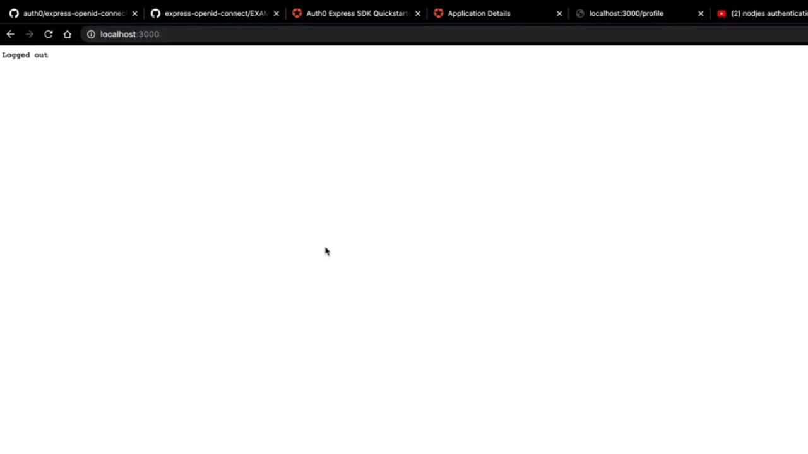
</div>
<br />

Es decir que con la llamada al logout el servidor de Auth0 lo que acaba haciendo es llamar a la url que hemos especificado como la redirección que se ha de llevar a cabo cuando se produce el proceso de logout en el sistema que, si recordamos, es la url raíz de la aplicación que estamos desarrollando.

Así, si ahora volvemos a instentar hacer login en nuestra aplicación acudiendo a http://localhost:3000/login nos vamos a encontrar con una página como la siguiente:

<div style='text-align: center'>
  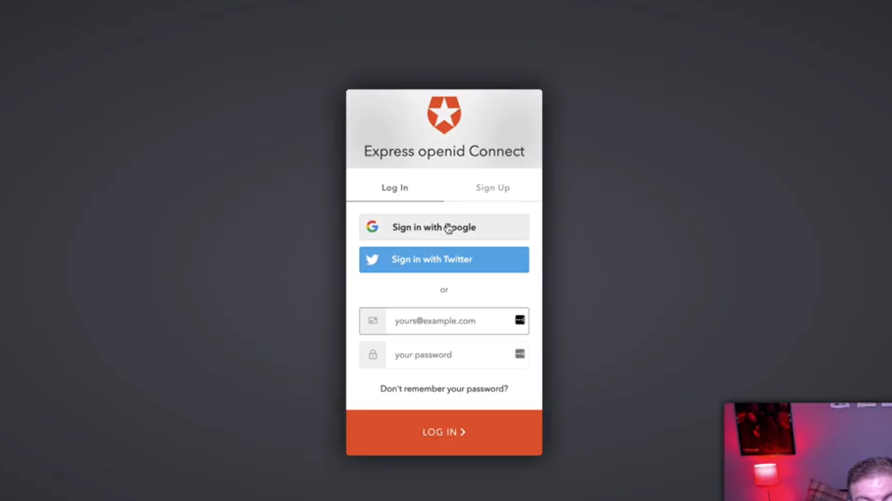
</div>
<br />

De tal manera que si proporcionamos nuestros datos de acceso para poder acceder a nuestra cuenta en Auth0 se llamará a la función callback declarada dentro de nuestra aplicación sin tener que volver a establecer de forma explícita que queremos conceder esa funcionalidad a la aplicación. Así la siguiente página que se nos mostrará será algo como los siguiente donde el mensaje de respuesta que obtendremos será *logged in* tal y como hemos establecido en la ruta de nuestra aplicación.

<div style='text-align: center'>
  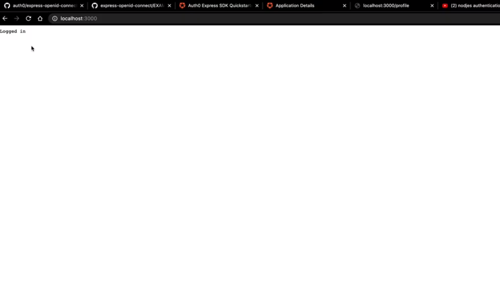
</div>
<br />

Vamos a seguir con el proceso de construcción de nuestra aplicación y vamos a pensar ahora que queremos crear una nueva ruta dentro de la misma en la que lo que pretendermos hacer es mostrar la información acerca del usuario que se está conectando. Para lograrlo vamos a hacer uso de una nueva función que nos proporciona la librería **express-openid-connect** que se denomina `requiresAuth` la cual actúa como un middleware al que podemos invocar como parte de la llamada a cualquiera de las funciones que implementan las rutas de nuestra aplicación con el fin de establecer que únicamente podrán ser llamadas siempre y cuando el usuario esté autentificado. Por lo tanto lo primero que vamos a hacer ahora es importar esta función:

```js
require('dotenv').config()
const express = require('express')
const { auth, requiresAuth } = require('express-openid-connect')
```

Hecho esto vamos a crear la ruta que nos muestre la información del usuario. Vamos a suponer que esta ruta queremos que esté disponible en la url http://localhost:3000/profile bajo el método http GET por lo que creamos la nueva ruta incando como segundo parámetro la función middleware que queremos que se ejecute antes de atender a la petición, es decir, que en nuestro segundo parámetro lo que que vamos a tener que hacer es invocar a la función `requiresAuth` para así poder asegurar que el usuario está autenticado en el sistema.

```js
app.get('/profile', requiresAuth(), (req, res) => { })
```

Lo que vamos a hacer ahora es que en el caso de que se tenga que responder a la ruta porque el usuraio está autentificado queremos coger el valor que está recogido en el atributo `oidc` que está ligado a la respuesta del servidor Auth0 y más concretamente obtener la información del objeto que está recogido en el atributo `user` que tiene vinculado. Es más, lo que vamos a hacer es enviar esta información como parte de la respuesta como si se tratase de un string por lo que haremos uso del método `stringify` del objeto JSON:

```js
app.get('/profile', requiresAuth(), (req, res) => {
  res.send(JSON.stringify(req.oidc.user))
})
```

Ahora si una vez que hacemos login en la aplicación realizamos una petición a la url http://localhost:3000/profile se nos mostrará toda la información del usuario que está loggeado como se puede ver a continuación:

<div style='text-align: center'>
  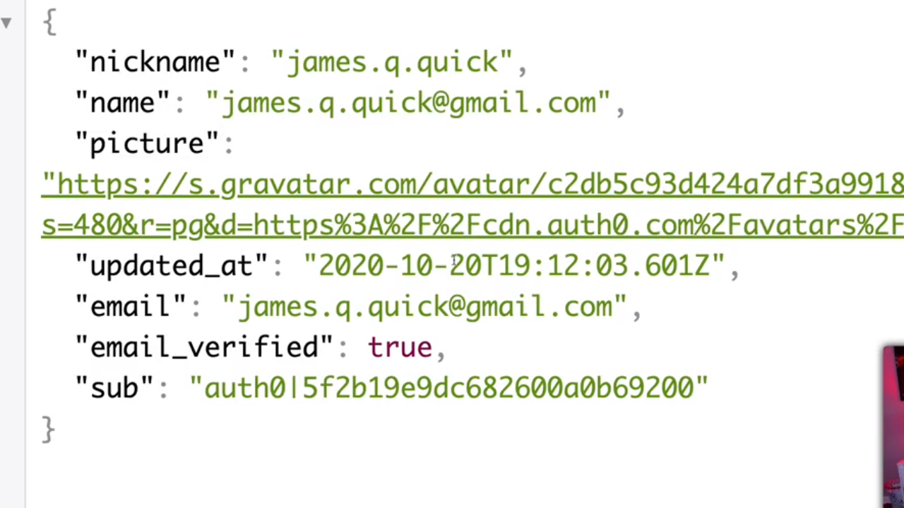
</div>
<br />

Lo interesante ahora es que si el usuario no está loggeado dentro de nuestra aplicación y hace referencia a una url para la cual sí que se pide que se esté loggeado (como es el caso de http://localhost:3000/profile en nuestra aplicación de ejemplo) el middleware `requiresAuth` que estamos utilizando no va a mandar ningún mensaje de error al usuario sino que le va a redireccionar a la página en la que se le piden los credenciales de acceso dentro de Auth0:

<div style='text-align: center'>
  
</div>
<br />

y si el usuario introduce los creadenciales de acceso correctos éste será redireccionado sin ningún tipo de problemas al recurso que estaba solicitando.

Por lo tanto hemos visto que para poder configurar la autentificación medainte Auth0 en una aplicación de Express utilizando la librería **express-openid-connect** es un proceso realmenete sencillo que podemos llevar a cabo con unas pocas líneas de código. El código completo de nuestra aplicación es el que se muestra a continuación:

```js
require('dotenv').config()
const express = require('express')
const { auth, requiresAuth } = require('express-openid-connect')

const app = express()
app.use(
  auth({
    authRequired: false,
    auth0Logout: true,
    issuerBaseURL: process.env.ISSUER_BASE_URL,
    baseURL: process.env.BASE_URL,
    clientID: process.env.CLIENT_ID,
    secret: process.env.SECRET
  })
)

app.get('/profile', requiresAuth(), (req, res) => {
  res.send(JSON.stringify(req.oidc.user))
})

app.get('/', (req, res) => {
  res.send(req.oidc.isAuthenticated() ? 'Logged in' : 'Logged out')
})

const port = process.env.PORT || 3000
app.listen(port, () => {
  console.log(`listening on port ${ port }`)
})
```

Antes de dar por finalizada la explicación nos queda por mencionar que es más que interesante leer los ejemplos que forman parte de la [documentación de la librería](https://github.com/auth0/express-openid-connect/blob/master/EXAMPLES.md) ya que en ellos se encuentran recogidos casos de uso a los que nos podemos enfrentar en nuestro día a día cuando estamos desarrollando aplicaciones en Express. Entre otras cosas ahí nos vamos a encontrar respuestas a las siguientes preguntas:

- ¿cómo podemos hacer para utilizar nuestras propias rutas para hacer el login y logout en nuestras aplicaciones?
- ¿cómo podemos hacer para obtener un token para acceder a otras API?
- ¿cómo podemos hacer para obtener un refresh token?
- ¿cómo establecer que determinadas rutas son accesibles en función de los roles de los usuarios?

## Recursos.

>
> - Express OpenID Connect Library: https://github.com/auth0/express-openid-connect.
> - Node.js Authentication Quick Start: https://auth0.com/docs/quickstart/webapp/express
>

---

<p align="right">ütima actualización: 10 de Enero de 2021.</p>
