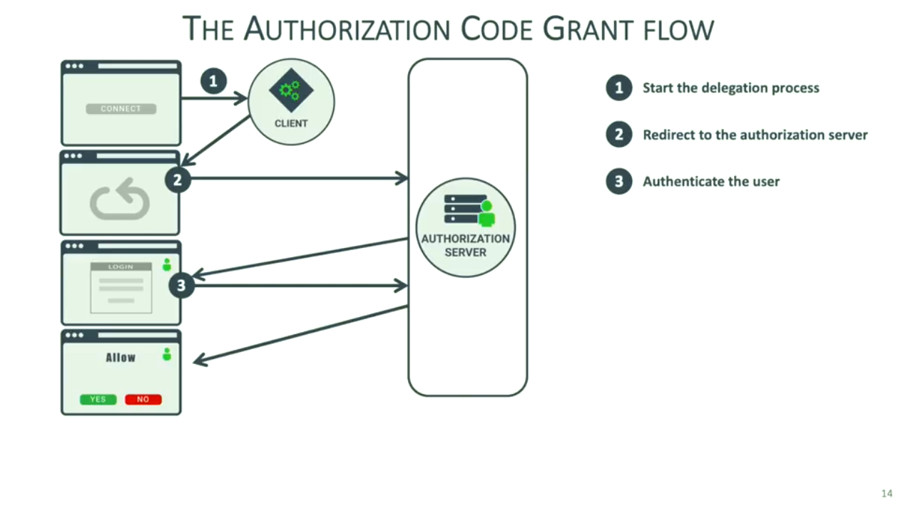

# Introduction to OAuth 2.0 and OpenID Connect.

>
> - Video: [GOTO 2018 • Introduction to OAuth 2.0 and OpenID Connect • Philippe De Ryck](https://www.youtube.com/watch?v=GyCL8AJUhww)
> - Canal: [GOTO Conferences](https://www.youtube.com/user/GotoConferences)
> - Fecha: 10 Enero 2019
> - Duración: 47:17
>

En este punto vamos a ver qué es OpenID Connect para entender qué problema trata de resolver y cómo está construido sobre OAuth 2.0 para poder lograr su objetivo. Pero para poder empezar con la explicación lo primero que tenemos que entender es por qué existe algo como OAuth 2.0 viendo cuál es el problema que trata de resolver.

Para ello vamos a empezar contando un escenario de un caso de uso del mundo real que pese a que no es muy frecuente en Europa sí que presenta un escenario muy común en los Estados Unidos. De hecho allí es bastante frecuente que cuando vamos a un restaurante sea posible dejar a uno de los trabajadores del mismo la responsabilidad de poder aparcar nuestro coche y aquí es donde nos puede resultar extraño a los europeos lo que sucede y es que mucho propietarios de coches poseen un juego de llaves especiales para este tipo de situaciones con las cuales únicamente se puede arrancar o abrir la puerta del coche pero no se puede, por ejemplo, abrir la guantera o el maletero. De alguna manera que cuando estamos entregando estas llaves a la persona del restaurante le estamos delegando la responsabilidad de aparcar el coche pero únicamente proporcionándole los medios que van a permitirle realizar esta tarea.

¿Demasiado abstracto con una situación del mundo real? Vamos a pensar en una aplicación informática. Pensemos en el caso de [Buffer](https://buffer.com/) que es una aplicación que permite de manera programática publicar tweets bajo las condiciones que nosotros le indiquemos:

  

 

Por ejemplo, gracias a Buffer podemos establece que un determinado tweet sea publicado en una determinada fecha y hora sin necesidad de que nosotros tengamos que hacerlo. Es decir, que de alguna manera estamos delegando a Buffer que se encargue de esta tarea pero siendo nosotros quiénes establecemos de forma explícita (en Twitter) que Buffer va a poder acceder a nuestra cuenta y por lo tanto realizar operaciones dentro de la misma. De hecho, en Twitter tenemos la posibilidad de ver qué aplicaciones están accediendo a nuestra cuenta y entre ellas podremos ver a Buffer:

  

 

Y esto es lo que OAuth 2.0 va a hacer por nosotros es decir, que se tratará de un mecanismo, como ya veremos, que va a permitir establecer o delegar los permisos que una aplicación va a tener sobre otra con el fin de realizar una serie de acciones dentro de las mismas.

Vamos ahora a centrarnos en entender de qué elementos está compuesto el esquema OAuth 2.0 desde un punto de vista arquitectónico pero desde una perspectiva elevada. En primer lugar tendremos el **Authorization Server (AS)** que es a quién las aplicaciones cliente (que en el esquema OAuth 2.0 se les conoce como **Client**) han de tener que consultar para determinar si pueden llevar a cabo una determinada accioón. En el ejemplo anterior nuestro Client sería la aplicación Buffer y el Authorization Server sería el servidor de Twitter:

  

 

Por lo tanto el Client va a determinar en el Authorization Server si nosotros, como usuarios, le hemos otorgado el control explícito para acceder a uno de los recursos que nosotros controlamos (en nuestro caso la cuenta de Twitter).

Ahora bien, para poder acceder al recurso que nosotros controlamos (la cuenta de Twitter en nuestro ejemplo) el Client ha de utilizar un Access Token que no es más que algo que será intercambiado entre el servidor de Twitter y Buffer de tal manera que determinará que la aplicación cliente va a poder publicar tweets por nosotros (es decir, que Buffer va a poder utilizar la API de Twitter para poder publicar un tweet).

  

 

Por lo tanto en access token es algo (una pieza de información) que el servidor de Twitter otorga a Buffer con la finalidad de acceder a un recurso compatido que en este caso es la API de Twitter. En el esquema de OAuth 2.0 la API de Twitter cumple el rol de lo que se conoce como **Resource Server**.

Por su parte el Resource Server va a necesitar de un mecanismo que le permita verificar junto con el Authorization Server que el token que ha recibido como parte de una petición de acceso a un recurso realmente concede dicho acceso o no por lo que necesitará comunicarse de alguna manera con el Authorization Server para poder llevar a cabo dicha verificación.

  

 

La especificación OAuth 2.0 proporciona la definición de cómo se ha de realizar la comunicaciónentre el Client y el Authorization Server con el fin de obtener acceso a los recursos recogidos en el Resource Server (la flecha que está recogida con el número 1 en la imagen anterior).

El paso 3 (verificar que el cliente tiene los permisos para poder acceder al recurso compartido) también forma parte de la especificación OAuth 2.0 pero no del core de la misma sino que se trata de una especificación separada y es más la forma en la que se ha de poder utilizar el access token para acceder a los recursos compartidos no es algo que esté cubierto por la especificación de OAuth 2.0.

## OAuth 2.0 The Client Perspective.

Vamos a centrarnos ahora en enteder cómo funciona OAuth 2.0 desde la perspectiva de una aplicación cliente, es decir, en nuestro ejemplo, vamos pensar en cómo funciona desde el punto de vista de la aplicación Buffer.

Lo primero que tenemos que entender es que construir una aplicación Client en OAuth 2.0 es algo relativamente sencillo. Ahora bien, lo que sí que tendremos que hacer siempre será registrar nuestra aplicación como un cliente válido dentro del Authorization Server. Volviendo al ejemplo de Twitter, tendríamos que registrar nuestra aplicación cliente dentro de Twitter para lo cual existe un formulario como el siguiente:

  

 

De entre toda la información anterior a parte de los campos que son obligatorios para el propio formulario en sí mismo y que forman parte de la información que precisa Twitter, desde el punto de vista de OAuth 2.0 vamos a tener que introducir la información de lo que se denomina **Callback Urls** que viene a recoger la url a la que será redireccionada la petición en el caso de que el proceso de autentificación dentro de la Twitter (es decir, que tras pedirle al usuario sus credenciales de acceso a Twitter y además tras especificar de forma explícita que se puede acceder a la API para el envío de los tweets) a qué url queremos que se llame.

Una vez terminamos este proceso Twitter nos va a proporcionar una serie de claves que vamos a poder utilizar para establecer la comunicación.

  

 

---
**Nota:** en el caso que nos ocupa Twitter es un ejemplo de un Authorization Server que está asociado a un servicio que es público. La especificación OAuth 2.0 no nos impide que nosotros podamos construir nuestro propio Authorization Server y como parte del mismo registremos todos los clientes que van a hacer uso del mismo sin tener que necesitar de un servicio público que se encargue de ello.

---

Una vez que tenemos establecido que nuestra aplicación es un cliente válido para el Authorization Server de Twitter vamos ahora a ver diferentes escenarios en los que estudiaremos el flujo de información que se produce durante un proceso de autorización mediante OAuth 2.0. 

## Client Credentials Grant.

En un primer ejemplo vamos a suponer que quermeos obtener un número determinar de tweets los cuales corresponden a una determinada cuenta dentro de Twitter. Por lo tanto aquí es cuando entra en juego uno de los flujos de información que se producen con OAuth 2.0 **Client Credentials Grant Flow**. Para explicarlo vamos a recordar los tres actores principales que tenemos en OAuth 2.0 y que están recogidos en la siguiente imagen:

  

 

En primer lugar el sistema Client accede al Authorization Server utilizando sus credenciales como cliente del sistema, es decir, en nuestro ejemplo, con las claves que nos ha proporcionado Twitter al registrar nuestra aplicación. Lo que queremos hacer con esta comunicación es pedirle al Authorization Server que nos proporcione un Access Token para poder acceder al Resource Server.

Así, si los credenciales de acceso como cliente son correctos (el cliente estará diciendo algo así como este es mi identificador de acceso a la aplicación y esta es la clave secreta que nos has facilitado para acceder) el Authorization Server nos contestará enviándonos un access token.

  

 

Es en este momento cuando el Client utiliza el access token que le acaban de facilitar para acceder al Resource Server haciendo una petición del tipo ¿puedo acceder a este recurso compartido? En nuestro ejemplo la pregunta que se haría sería algo así como ¿puedo acceder a esta lista de tweets de esta cuenta de usuario?

  

 

Como la información de los tweets de una cuenta es un recurso que en principio es público vamos a suponer que el Resource Server no tienen ningún problema en proporcionarle la información al Client por lo que responde a la petición con la lista de los tweets que ha solicitado.

  

 

Como se puede ver esta información se ha proporcionado como consecuencia de haber realizado una comprobación de los permisos (una comprobación de la autorización) que en este caso ha sido muy simple ya que hemos considerado que todos los tweets son públicos y por lo tanto no hay ningún problema en proporcionárselos al usuario.

  

 

Sin embargo sabemos que OAuth 2.0 está pensado para delegar el acceso a los recursos compartidos por parte del Authorization Server a los Client pero en el caso de uso que acabamos de comentar estamos frente a una situación en la que simplemente se está accediendo de forma directa a un recurso compartido. Es más, ni tan siquiera deberíamos haber tenido que pasar por el Authorization Server porque, como ya hemos mencionado, la información de los tweets es pública y por lo tanto se podría haber obtenido de forma directa sin hacer uso del access token.

Este primer escenario representa lo que se denomina en terminología de OAuth 2.0 **Client Crendential Grant** el cual viene a decir algo así como "si tienes el token de acceso entonces puedes acceder al recurso compartido". Por lo tanto este tipo de credencial es para el acceso de máquina a máquina sin que haya interacción del usuario de ningún tipo.

## The Authorization Code Grant.

Vamos con una segundo escenario en el que lo que ahora pretendemos es poder programar el momento del día en el que queremos que se publique un tweet en nuestra cuenta de forma análoga a como hace la aplicación Buffer. En este caso lo que tenemos que conseguir es que nuestra aplicación cliente sea capaz de preguntar al usuario algo así como "ey, puedo acceder a tu cuenta de usuario y publicar tweets en tu nombre". Esto es lo que se conoce como el **Authorization Code Grant**.

  

 

La idea que nos tiene que quedar es que para lograr este permiso (grant en la terminología de OAuth 2.0) todo se basa en al obtención de un token. Vamos a explicarlo mediante una serie de diagramas. Comenzamos con un sistema como el siguiente en el que estarán involucrados una serie de actores:

  

 

En este caso el Client va a ser la aplicación que va a querer publicar los tweets por nosotros en función de la programación que establezcamos dentro de la misma (en nuestro ejemplo sería la aplicación Buffer). Además es necesario que se trate de una aplicación backend porque vamos a tener que guardar una clave secreta para realizar la comunicación y el único lugar en el que vamos a poder estar seguros de que la clave no es accesible es si se trata de una aplicación alojada en un servidor backend.

El flujo comenzará con nuestra aplicación Client solicitando al navegador que inicie una petición de acceso:

  

 

y esta petición de acceso normalmente es una redirección que es lanzada sobre el Authorization Server donde realmente se estará tratando la petición de acceso:

  

 

Es el Authorization Server el que presenta la petición de acceso al usuario al que pertenece en nuestro ejemplo la cuenta de Twiter para la cual nuestras aplicación backend (Client) quiere publicar los tweets en el momento en el que serán programados con lo que en última instancia le estará pidiendo que se autentifique el mismo.

  

 

Este paso puede ser ignorado en el caso de que el usuario se haya loggeado previamente en su cuenta pero vamos a suponer que no es este el caso. Ahora bien, lo que tenemos que entender es que si estamos por ejemplo trabajando con Twitter los credenciales de acceso que se pedirán serán los de Twitter que el usuario los ha de proporcionar normalmente rellenando un formulario de acceso.

  

 

En el caso de que los credenciales sean correctos el Authorization Server solicita al usuario la autorización explícita de los permisos para que la aplicación cliente pueda publicar tweets en su nombre:

  

 

Es en este punto donde el Authorization Server de Twitter viene a preguntar al usuario algo así como "la aplicación Buffer está intentando acceder a tu cuenta de Twitter ¿quieres dejar que lo haga y además que publique tweets con ella?". En el caso de que así sea el usaurio autorizará la comunicación y se lo comunicará al Authorization Server:

  

 

En este punto el Authorization Server sabe dos cosas: primero que el usuario se ha autentificado en el sistema con sus credenciales de acceso y segundo que ha marcado de forma explícita la autorización para poder publicar tweets en su nombre por lo que envía al navegador desde el que se ha lanzado la petición de acceso una redirección que incluirá un código de autorización:

  

 

Y es en este punto donde el navegador invocará de nuevo a la aplicación backend (que sabrá cual es el endpoint a llamar porque así vendrá en la redirección) pasándole además el authorization code

  

 

Pero ¿cómo sabe el Authorization Server a qué dirección tiene que llamar como parte de la redicción que se produce? La respuesta es sencilla en el momento en el que sabemos que junto con la petición de acceso que necesita para trabajar se mandará la información de la url que se ha de llamar en el caso de que se produzca una redirección (básicamente la aplicación Client como parte de la petición de acceso está diciendo "si tienes que mandarme algo como resultado de este proceso por favor envíalo a la url que te indico como parte de la petición").

Lo siguiente que tenemos que saber es que el authorization code que hemos recibido no va a proporcionar el acceso a nada ya que no es un token por lo que el siguiente paso consiste en que la aplicación Client intercambiará este código junto con los propios credenciales de aplicación (es decir, los credenciales que son de la aplicación Client no del usuario) con el Authorization Server para poder obtener un token de acceso:

  

 

Esta información es procesada por al Authorization Server y si todo es correcto enviará a la aplicación cliente no un token si no dos: el Access Token y el Refresh Token siendo únicamente obligatorio que se nos envíe el primero ya que es el que en última instancia nos va a permitir acceder al Resource Server. Y no solamemente esto sino que además este proceso de generación del tolen va a precisar del uso de los credenciales de la aplicación Client ya que únicamente va a poderse generar el token para la aplicación concreta y para el código que se reciba.

  

 

Una vez tenemos el access token la aplicación Client ya puede acceder al Resource Server con lo que va a poder realizar la acción para la que ha sido autorizada. En nuestro ejemplo esto significará que la aplicación cliente (Buffer) va a poder acceder a la cuenta del usuario y publicar un determinado tweet.

  

 

El último paso de lo que se hace es confirmar el acceso al recurso compartido que en este caso será la API de Twitter y la publicación del tweet programado.

  

 

En todo el proceso anterior lo que se puede ver es lo que al final está haciendo OAuth 2.0 por el usuario que no es otra cosa que autorizar a los sistema (aplicaciones cliente) a que realicen acciones en su nombre siendo este el proceso más complejo ya que pese a que se obtiene un código de acceso por parte del usuario el Authorization Server está además obligando a que la propia aplicación Client tenga que presentar tus propios credenciales de acceso para obtener los token. Además, el código de autorización que se obtiene por parte del usuario es válido por una cantidad de tiempo relativamente pequeña (normalmente de un minuto).

Pero ¿qué es lo que realmente ve el usaurio cuando se inicia este flujo dentro de la aplicación? Supongamos que estamos en una página en la que nos aparece a continuación donde el botón *connect* viene a simular una pregunta del tipo "¿puedo conectarme a tu cuenta de twitter para enviar tweets en tu nombre?" 

  

 

de tal manea que cuando se pulsa sobre dicho botón es cuando comienza el proceso de delegación de la petición lo que supone que se va a llamar a la aplicación Client (en este caso la aplicación backend):

  

 

Como ya hemos descrito anteriormente la aplicación Client comenzará respondiendo a la petición con una petición de redirección al navegador del cliente (la que incluirá información propia de ella misma como la url a la que ha de redireccionar el Authorization Server en el caso de que todo el proceso haya finalizado correctamente) para que se envíe la petición al Authorization Server de la aplicación con la que se está trabajando (en este caso el Authorization Server de Twitter)

  

 

Esta petición de resolución de una redirección no se diferencia en absoluto de cualquier otra petición de redirección por lo que lo que hace el navegador del cliente es crear mandarla al Authorization Server para que la procese:

  

 

Y este responderá mostrándo en el navegador la página de login dentro del Authorization Server:

  

 

Hay que tener en cuenta que esta página de login del Authorization Server no siempre es necesaria porque de alguna manera se están recordando los credenciales de acceso del usuario pero vamos a suponer que no es así (si ya se hubiesen proporcionado estos credenciales simplemente nos saltaríamos este paso). El usuario proporciona dichos credenciales de acceso:

  

 

Y si estos son correctos el Authorization Server nos mostrará una página en la que se nos estará informando de la aplicación que está requiriendo el acceso y qué tipo de permisos está solicitando (en nuestro caso nos informaría de que la aplicación es Buffer y que está solicitando el tener acceso a nuestra cuenta para poder enviar tweets en nuestro nombre) solcitando de esta manera que se le otorgue el permiso de forma explícita. 

  

 

Es más, para poder continuar con el flujo de autorización el usuario ha de proporcionar ese consentimiento de forma explícita y solamente en el caso de que se le otorgue continuará el proceso:

  

 

Video 14:40

## OAuth 2.0 The Resource Server Perspective.

