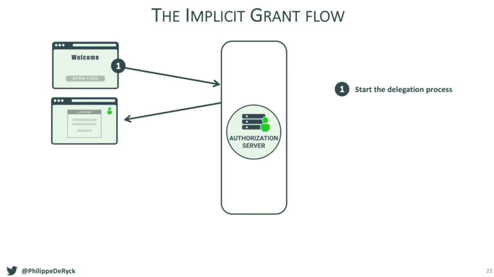
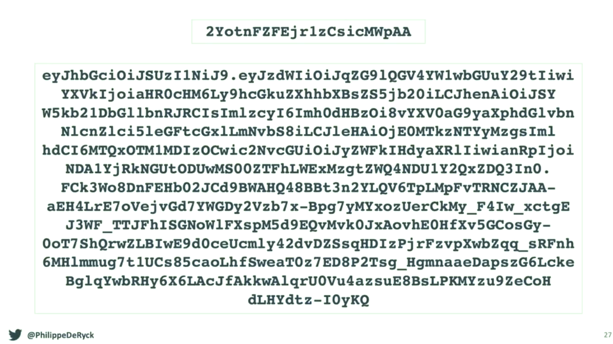
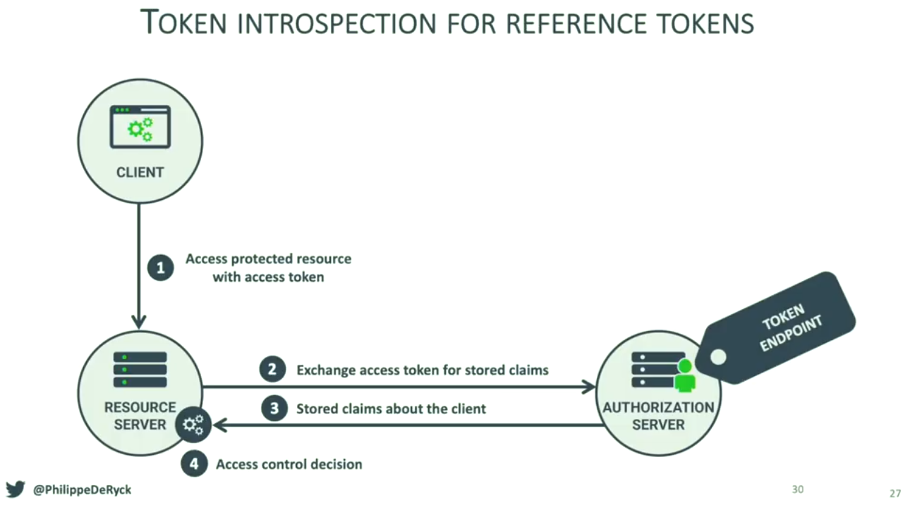
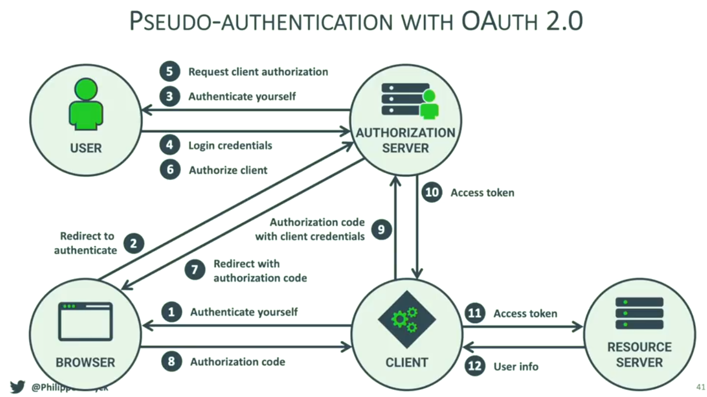
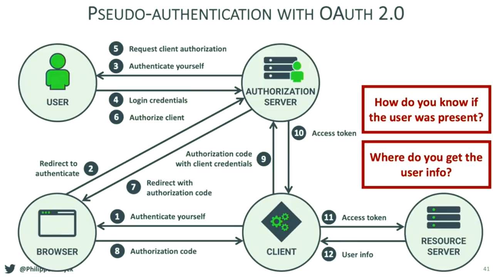
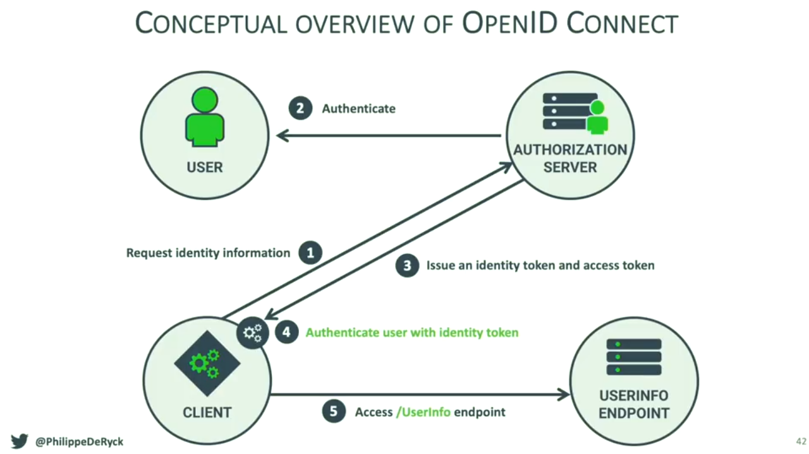

# Introduction to OAuth 2.0 and OpenID Connect.

>
> - Video: [GOTO 2018 • Introduction to OAuth 2.0 and OpenID Connect • Philippe De Ryck](https://www.youtube.com/watch?v=GyCL8AJUhww)
> - Canal: [GOTO Conferences](https://www.youtube.com/user/GotoConferences)
> - Fecha: 10 Enero 2019
> - Duración: 47:17
>

En este punto vamos a ver qué es OpenID Connect para entender qué problema trata de resolver y cómo está construido sobre OAuth 2.0 para poder lograr su objetivo. Pero para poder empezar con la explicación lo primero que tenemos que entender es por qué existe algo como OAuth 2.0 viendo cuál es el problema que trata de resolver.

Para ello vamos a empezar contando un escenario de un caso de uso del mundo real que pese a que no es muy frecuente en Europa sí que presenta un escenario muy común en los Estados Unidos. De hecho allí es bastante frecuente que cuando vamos a un restaurante sea posible dejar a uno de los trabajadores del mismo la responsabilidad de poder aparcar nuestro coche y aquí es donde nos puede resultar extraño a los europeos lo que sucede y es que mucho propietarios de coches poseen un juego de llaves especiales para este tipo de situaciones con las cuales únicamente se puede arrancar o abrir la puerta del coche pero no se puede, por ejemplo, abrir la guantera o el maletero. De alguna manera que cuando estamos entregando estas llaves a la persona del restaurante le estamos delegando la responsabilidad de aparcar el coche pero únicamente proporcionándole los medios que van a permitirle realizar esta tarea.

¿Demasiado abstracto con una situación del mundo real? Vamos a pensar en una aplicación informática. Pensemos en el caso de [Buffer](https://buffer.com/) que es una aplicación que permite de manera programática publicar tweets bajo las condiciones que nosotros le indiquemos:

  

 

Por ejemplo, gracias a Buffer podemos establece que un determinado tweet sea publicado en una determinada fecha y hora sin necesidad de que nosotros tengamos que hacerlo. Es decir, que de alguna manera estamos delegando a Buffer que se encargue de esta tarea pero siendo nosotros quiénes establecemos de forma explícita (en Twitter) que Buffer va a poder acceder a nuestra cuenta y por lo tanto realizar operaciones dentro de la misma. De hecho, en Twitter tenemos la posibilidad de ver qué aplicaciones están accediendo a nuestra cuenta y entre ellas podremos ver a Buffer:

  

 

Y esto es lo que OAuth 2.0 va a hacer por nosotros es decir, que se tratará de un mecanismo, como ya veremos, que va a permitir establecer o delegar los permisos que una aplicación va a tener sobre otra con el fin de realizar una serie de acciones dentro de las mismas.

Vamos ahora a centrarnos en entender de qué elementos está compuesto el esquema OAuth 2.0 desde un punto de vista arquitectónico pero desde una perspectiva elevada. En primer lugar tendremos el **Authorization Server (AS)** que es a quién las aplicaciones cliente (que en el esquema OAuth 2.0 se les conoce como **Client**) han de tener que consultar para determinar si pueden llevar a cabo una determinada accioón. En el ejemplo anterior nuestro Client sería la aplicación Buffer y el Authorization Server sería el servidor de Twitter:

  

 

Por lo tanto el Client va a determinar en el Authorization Server si nosotros, como usuarios, le hemos otorgado el control explícito para acceder a uno de los recursos que nosotros controlamos (en nuestro caso la cuenta de Twitter).

Ahora bien, para poder acceder al recurso que nosotros controlamos (la cuenta de Twitter en nuestro ejemplo) el Client ha de utilizar un Access Token que no es más que algo que será intercambiado entre el servidor de Twitter y Buffer de tal manera que determinará que la aplicación cliente va a poder publicar tweets por nosotros (es decir, que Buffer va a poder utilizar la API de Twitter para poder publicar un tweet).

  

 

Por lo tanto en access token es algo (una pieza de información) que el servidor de Twitter otorga a Buffer con la finalidad de acceder a un recurso compatido que en este caso es la API de Twitter. En el esquema de OAuth 2.0 la API de Twitter cumple el rol de lo que se conoce como **Resource Server**.

Por su parte el Resource Server va a necesitar de un mecanismo que le permita verificar junto con el Authorization Server que el token que ha recibido como parte de una petición de acceso a un recurso realmente concede dicho acceso o no por lo que necesitará comunicarse de alguna manera con el Authorization Server para poder llevar a cabo dicha verificación.

  

 

La especificación OAuth 2.0 proporciona la definición de cómo se ha de realizar la comunicaciónentre el Client y el Authorization Server con el fin de obtener acceso a los recursos recogidos en el Resource Server (la flecha que está recogida con el número 1 en la imagen anterior).

El paso 3 (verificar que el cliente tiene los permisos para poder acceder al recurso compartido) también forma parte de la especificación OAuth 2.0 pero no del core de la misma sino que se trata de una especificación separada y es más la forma en la que se ha de poder utilizar el access token para acceder a los recursos compartidos no es algo que esté cubierto por la especificación de OAuth 2.0.

## OAuth 2.0 The Client Perspective.

Vamos a centrarnos ahora en enteder cómo funciona OAuth 2.0 desde la perspectiva de una aplicación cliente, es decir, en nuestro ejemplo, vamos pensar en cómo funciona desde el punto de vista de la aplicación Buffer.

Lo primero que tenemos que entender es que construir una aplicación Client en OAuth 2.0 es algo relativamente sencillo. Ahora bien, lo que sí que tendremos que hacer siempre será registrar nuestra aplicación como un cliente válido dentro del Authorization Server. Volviendo al ejemplo de Twitter, tendríamos que registrar nuestra aplicación cliente dentro de Twitter para lo cual existe un formulario como el siguiente:

  

 

De entre toda la información anterior a parte de los campos que son obligatorios para el propio formulario en sí mismo y que forman parte de la información que precisa Twitter, desde el punto de vista de OAuth 2.0 vamos a tener que introducir la información de lo que se denomina **Callback Urls** que viene a recoger la url a la que será redireccionada la petición en el caso de que el proceso de autentificación dentro de la Twitter (es decir, que tras pedirle al usuario sus credenciales de acceso a Twitter y además tras especificar de forma explícita que se puede acceder a la API para el envío de los tweets) a qué url queremos que se llame.

Una vez terminamos este proceso Twitter nos va a proporcionar una serie de claves que vamos a poder utilizar para establecer la comunicación.

  

 

---
**Nota:** en el caso que nos ocupa Twitter es un ejemplo de un Authorization Server que está asociado a un servicio que es público. La especificación OAuth 2.0 no nos impide que nosotros podamos construir nuestro propio Authorization Server y como parte del mismo registremos todos los clientes que van a hacer uso del mismo sin tener que necesitar de un servicio público que se encargue de ello.

---

Una vez que tenemos establecido que nuestra aplicación es un cliente válido para el Authorization Server de Twitter vamos ahora a ver diferentes escenarios en los que estudiaremos el flujo de información que se produce durante un proceso de autorización mediante OAuth 2.0. 

### Client Credentials Grant.

En un primer ejemplo vamos a suponer que quermeos obtener un número determinar de tweets los cuales corresponden a una determinada cuenta dentro de Twitter. Por lo tanto aquí es cuando entra en juego uno de los flujos de información que se producen con OAuth 2.0 **Client Credentials Grant Flow**. Para explicarlo vamos a recordar los tres actores principales que tenemos en OAuth 2.0 y que están recogidos en la siguiente imagen:

  

 

En primer lugar el sistema Client accede al Authorization Server utilizando sus credenciales como cliente del sistema, es decir, en nuestro ejemplo, con las claves que nos ha proporcionado Twitter al registrar nuestra aplicación. Lo que queremos hacer con esta comunicación es pedirle al Authorization Server que nos proporcione un Access Token para poder acceder al Resource Server.

Así, si los credenciales de acceso como cliente son correctos (el cliente estará diciendo algo así como este es mi identificador de acceso a la aplicación y esta es la clave secreta que nos has facilitado para acceder) el Authorization Server nos contestará enviándonos un access token.

  

 

Es en este momento cuando el Client utiliza el access token que le acaban de facilitar para acceder al Resource Server haciendo una petición del tipo ¿puedo acceder a este recurso compartido? En nuestro ejemplo la pregunta que se haría sería algo así como ¿puedo acceder a esta lista de tweets de esta cuenta de usuario?

  

 

Como la información de los tweets de una cuenta es un recurso que en principio es público vamos a suponer que el Resource Server no tienen ningún problema en proporcionarle la información al Client por lo que responde a la petición con la lista de los tweets que ha solicitado.

  

 

Como se puede ver esta información se ha proporcionado como consecuencia de haber realizado una comprobación de los permisos (una comprobación de la autorización) que en este caso ha sido muy simple ya que hemos considerado que todos los tweets son públicos y por lo tanto no hay ningún problema en proporcionárselos al usuario.

  

 

Sin embargo sabemos que OAuth 2.0 está pensado para delegar el acceso a los recursos compartidos por parte del Authorization Server a los Client pero en el caso de uso que acabamos de comentar estamos frente a una situación en la que simplemente se está accediendo de forma directa a un recurso compartido. Es más, ni tan siquiera deberíamos haber tenido que pasar por el Authorization Server porque, como ya hemos mencionado, la información de los tweets es pública y por lo tanto se podría haber obtenido de forma directa sin hacer uso del access token.

Este primer escenario representa lo que se denomina en terminología de OAuth 2.0 **Client Crendential Grant** el cual viene a decir algo así como "si tienes el token de acceso entonces puedes acceder al recurso compartido". Por lo tanto este tipo de credencial es para el acceso de máquina a máquina sin que haya interacción del usuario de ningún tipo.

  

 

### The Authorization Code Grant.

Vamos con una segundo escenario en el que lo que ahora pretendemos es poder programar el momento del día en el que queremos que se publique un tweet en nuestra cuenta de forma análoga a como hace la aplicación Buffer. En este caso lo que tenemos que conseguir es que nuestra aplicación cliente sea capaz de preguntar al usuario algo así como "ey, puedo acceder a tu cuenta de usuario y publicar tweets en tu nombre". Esto es lo que se conoce como el **Authorization Code Grant**.

  

 

La idea que nos tiene que quedar es que para lograr este permiso (grant en la terminología de OAuth 2.0) todo se basa en al obtención de un token. Vamos a explicarlo mediante una serie de diagramas. Comenzamos con un sistema como el siguiente en el que estarán involucrados una serie de actores:

  

 

En este caso el Client va a ser la aplicación que va a querer publicar los tweets por nosotros en función de la programación que establezcamos dentro de la misma (en nuestro ejemplo sería la aplicación Buffer). Además es necesario que se trate de una aplicación backend porque vamos a tener que guardar una clave secreta para realizar la comunicación y el único lugar en el que vamos a poder estar seguros de que la clave no es accesible es si se trata de una aplicación alojada en un servidor backend.

El flujo comenzará con nuestra aplicación Client solicitando al navegador que inicie una petición de acceso:

  

 

y esta petición de acceso normalmente es una redirección que es lanzada sobre el Authorization Server donde realmente se estará tratando la petición de acceso:

  

 

Es el Authorization Server el que presenta la petición de acceso al usuario al que pertenece en nuestro ejemplo la cuenta de Twiter para la cual nuestras aplicación backend (Client) quiere publicar los tweets en el momento en el que serán programados con lo que en última instancia le estará pidiendo que se autentifique el mismo.

  

 

Este paso puede ser ignorado en el caso de que el usuario se haya loggeado previamente en su cuenta pero vamos a suponer que no es este el caso. Ahora bien, lo que tenemos que entender es que si estamos por ejemplo trabajando con Twitter los credenciales de acceso que se pedirán serán los de Twitter que el usuario los ha de proporcionar normalmente rellenando un formulario de acceso.

  

 

En el caso de que los credenciales sean correctos el Authorization Server solicita al usuario la autorización explícita de los permisos para que la aplicación cliente pueda publicar tweets en su nombre:

  

 

Es en este punto donde el Authorization Server de Twitter viene a preguntar al usuario algo así como "la aplicación Buffer está intentando acceder a tu cuenta de Twitter ¿quieres dejar que lo haga y además que publique tweets con ella?". En el caso de que así sea el usaurio autorizará la comunicación y se lo comunicará al Authorization Server:

  

 

En este punto el Authorization Server sabe dos cosas: primero que el usuario se ha autentificado en el sistema con sus credenciales de acceso y segundo que ha marcado de forma explícita la autorización para poder publicar tweets en su nombre por lo que envía al navegador desde el que se ha lanzado la petición de acceso una redirección que incluirá un código de autorización:

  

 

Y es en este punto donde el navegador invocará de nuevo a la aplicación backend (que sabrá cual es el endpoint a llamar porque así vendrá en la redirección) pasándole además el authorization code

  

 

Pero ¿cómo sabe el Authorization Server a qué dirección tiene que llamar como parte de la redicción que se produce? La respuesta es sencilla en el momento en el que sabemos que junto con la petición de acceso que necesita para trabajar se mandará la información de la url que se ha de llamar en el caso de que se produzca una redirección (básicamente la aplicación Client como parte de la petición de acceso está diciendo "si tienes que mandarme algo como resultado de este proceso por favor envíalo a la url que te indico como parte de la petición").

Lo siguiente que tenemos que saber es que el authorization code que hemos recibido no va a proporcionar el acceso a nada ya que no es un token por lo que el siguiente paso consiste en que la aplicación Client intercambiará este código junto con los propios credenciales de aplicación (es decir, los credenciales que son de la aplicación Client no del usuario) con el Authorization Server para poder obtener un token de acceso:

  

 

Esta información es procesada por al Authorization Server y si todo es correcto enviará a la aplicación cliente no un token si no dos: el Access Token y el Refresh Token siendo únicamente obligatorio que se nos envíe el primero ya que es el que en última instancia nos va a permitir acceder al Resource Server. Y no solamemente esto sino que además este proceso de generación del tolen va a precisar del uso de los credenciales de la aplicación Client ya que únicamente va a poderse generar el token para la aplicación concreta y para el código que se reciba.

  

 

Una vez tenemos el access token la aplicación Client ya puede acceder al Resource Server con lo que va a poder realizar la acción para la que ha sido autorizada. En nuestro ejemplo esto significará que la aplicación cliente (Buffer) va a poder acceder a la cuenta del usuario y publicar un determinado tweet.

  

 

El último paso de lo que se hace es confirmar el acceso al recurso compartido que en este caso será la API de Twitter y la publicación del tweet programado.

  

 

En todo el proceso anterior lo que se puede ver es lo que al final está haciendo OAuth 2.0 por el usuario que no es otra cosa que autorizar a los sistema (aplicaciones cliente) a que realicen acciones en su nombre siendo este el proceso más complejo ya que pese a que se obtiene un código de acceso por parte del usuario el Authorization Server está además obligando a que la propia aplicación Client tenga que presentar tus propios credenciales de acceso para obtener los token. Además, el código de autorización que se obtiene por parte del usuario es válido por una cantidad de tiempo relativamente pequeña (normalmente de un minuto).

Pero ¿qué es lo que realmente ve el usaurio cuando se inicia este flujo dentro de la aplicación? Supongamos que estamos en una página en la que nos aparece a continuación donde el botón *connect* viene a simular una pregunta del tipo "¿puedo conectarme a tu cuenta de twitter para enviar tweets en tu nombre?" 

  

 

de tal manea que cuando se pulsa sobre dicho botón es cuando comienza el proceso de delegación de la petición lo que supone que se va a llamar a la aplicación Client (en este caso la aplicación backend):

  

 

Como ya hemos descrito anteriormente la aplicación Client comenzará respondiendo a la petición con una petición de redirección al navegador del cliente (la que incluirá información propia de ella misma como la url a la que ha de redireccionar el Authorization Server en el caso de que todo el proceso haya finalizado correctamente) para que se envíe la petición al Authorization Server de la aplicación con la que se está trabajando (en este caso el Authorization Server de Twitter)

  

 

Esta petición de resolución de una redirección no se diferencia en absoluto de cualquier otra petición de redirección por lo que lo que hace el navegador del cliente es crear mandarla al Authorization Server para que la procese:

  

 

Y este responderá mostrándo en el navegador la página de login dentro del Authorization Server:

  

 

Hay que tener en cuenta que esta página de login del Authorization Server no siempre es necesaria porque de alguna manera se están recordando los credenciales de acceso del usuario pero vamos a suponer que no es así (si ya se hubiesen proporcionado estos credenciales simplemente nos saltaríamos este paso). El usuario proporciona dichos credenciales de acceso:

  

 

Y si estos son correctos el Authorization Server nos mostrará una página en la que se nos estará informando de la aplicación que está requiriendo el acceso y qué tipo de permisos está solicitando (en nuestro caso nos informaría de que la aplicación es Buffer y que está solicitando el tener acceso a nuestra cuenta para poder enviar tweets en nuestro nombre) solcitando de esta manera que se le otorgue el permiso de forma explícita. 

  

 

Es más, para poder continuar con el flujo de autorización el usuario ha de proporcionar ese consentimiento de forma explícita y solamente en el caso de que se le otorgue continuará el proceso:

  

 

Al indicar de forma explícita que se está otorgando al autorización el Authorization Server envía una nueva petición de redirección al navegador del usuario:

  

 

que al final lo que hace que el navegador del usaurio envíe una nueva petición a la dirección que ha sido especificada como dirección de redirección en la petición que ha recibido el Authorization Server junto con el código de autorización que éste ha creado para que lo pueda utilizar.

  

 

El siguiente paso va a consistir en un intercambio de información entre el Client y el Authorization Server utilizando para ello el código que este le ha proporcionado con el fin de obtener los token que son necesarios para poder acceder a los recursos:

  

 

Y por último se accede al recurso realizando la acción para la cual se haya concedido el permiso.

  

 

>
> En OAuth 2.0 es muy importante entender que siempre el usuario es redirigido al lugar en el que se encuentra el recurso para el cual quiere dar acceso al recurso compartido. En nuestro ejemplo esto quiere decir que nuestro usuario ha sido redirigido a Twitter con el fin de que ahí otorgue de forma explícita el acceso a su cuenta para poder enviar tweets en su nombre.
>

---
**Nota:** durante la explicación hemos mencionado que el usuario también va a recibir un refresh token como parte de la interacción que se lleva a cabo con el Authorization Server. Sin querer entrar en detalle de cómo funciona este token ya que si no se alargaría demasiado la explicación simplemente indicar que es gracias a este token que vamos a permitir obtener posteriormente un nuevo token de acceso (access token) cuando sea necesario sin tener que pasar por todo el proceso desde el inicio.

---
**Nota:** tenemos que entender que los access token tienen un periodo de validez limitado y normalmente corto (generalmente en torno a los 10 minutos) de tal manera que, siguiendo con nuestro ejemplo, si más adelante queremos enviar un nuevo tweet (por ejemplo, mañana) es necesario que obtengamos un nuevo access token.

Pero como podemos imaginar es posible que nosotros, los usuarios de la aplicación Buffer, no estemos conectados al sistema a la hora que hemos programado el envío del nuevo tweet por lo que no podríamos iniciar de nuevo el proceso pero lo que la aplicación sí que puede hacer es utilizar el refresh token para conseguir un nuevo access token sin más que ir al Authorization Server con la información de dicho refresh token y decirle algo así como "¿recuerdas que me has facilitado este refresh token hacen x tiempo? me gustaría utilizarlo para obtener un nuevo access token". El Authorization Server verificará el refresh token y si todo va bien va a enviar a la aplicación un nuevo access token y así Buffer va a poder enviar de nuevo tweets cuando estén programados.

Vamos a deternernos unos instantes en entender los detalles internos que hacen posible la comunicación que acabamos de describir. Lo primero que tenemos que entender es que toda la comunicación entre los diversos actores que están involucrados en el sistema realizar el intercambio de información utilizando http (más concretamente sobre https porque la comunicación se ha de hacer de forma segura).

La primera comunicación que se realiza es mediante una petición como la que se muestra a continuación:

  

 

Donde lo que estamos haciendo es una petición https al Authorization Server de Twitter indicando que lo que queremos obtener es un código de acceso (cosa que se establece con el valor `code` asignándolo al parámetro `response_type` en la query string que acompaña a dicha petición). Como parte de la petición tenemos que proporcionar cuál es nuevo identificador como Client (en el parámetro `client_id`), los tipos de accesos que queremos obtener en parámetro `scope` (en este caso queremos poder leer y escribir en el cuenta del usuario), la dirección a la que queremos que sea redireccionada la petición en el caso de que todo funcione correctamente (en el parámetro `redirect_uri`), un parámetro `state` en el que estableceremos un valor aleatorio que servirá para posteriormente hacer comprobaciones y evitar ataques del tipo [CSFR](https://es.wikipedia.org/wiki/Cross-site_request_forgery) ya que OAuth 2.0 garantiza en la especificación que cualquier valor que se deposite en el mismo será retornado como tal cuando se reciba la redirección por lo que podremos comprobar que el valor enviado y el recibido es exactamente el mismo evitando este tipo de ataques.

¿Cómo es la respuesta que nos enviará el Authorization Server en el caso de que todo el proceso haya ido correctamente? Pues la podemos ver en la siguiente imagen:

  

 

Lo primero que nos tenemos que fijar es que la url a la que se ha llamado es a la que que se ha especificado en el parámetro `redirect_uri` cuando se ha realizado la petición y junto con la petición se recibe el parámetro de la query string `code` que es el que posteriormente vamos a tener que intercambiar con el Authorization Server para obtener el access token. Además se recibe en el parámetro `state` el mismo valor que nosotros hayamos enviado y por lo tanto que podremos utilizar para comprobar que no se ha producido ningún tipo de ataque durante la comunicación.

¿Cómo es ahora el intercambio de información que se produce entre nuestra aplicación cliente y el Authorization Server con el fin de obtener la información de los token? La petición que la aplicación cliente tiene que enviar al Authorization Server tiene un aspecto como el siguiente:

  

 

Lo primero que se tiene que entender es que se trata de una aplicación entre dos servidores (se puede considerar a la aplicación cliente como un servidor) entendiendo como tal que no estará involucrado para nada un navegador web por lo que el método de comunicación será POST. Junto con dicha petición se está enviando una cabedera http `Authorization` en la que se envían las credenciales de la aplicación Cliente para poder realizar la autentificación de la misma utilizando el mecanismo de autenficación http *Basic*. En el cuerpo de la petición se envia el tipo de operación que se quiere llevar a cabo en el parámetro `grant_type` (que en este caso ha de ser `authorization_code` y que básicamente lo que viene a indicar es que se quiere cambiar el código que se proporcionará por un access token), la dirección a la que se ha de redireccionar en el que caso de que todo el proceso funcione correctamnete en el parámetro `redirect_uri`, cuál es el identificador de la aplicación cliente en el parámetro `client_id` y por último el código de acceso que se ha obtenido en el paso anterior en el parámetro `code`.

¿Cómo es la información de respuesta que obtendremos en el caso de que todo el proceso finalice correctamente? Pues la podemos ver en la siguiente imagen:

  

 

Pues como se puede ver estaremos recibiendo un objeto JSON contendrá tanto el access como el refresh token además de incluir información adicional como el periodo de validez de dicho token o el tipo de token del que se trata que ayudarán a determinar cada cuanto ha de ser renovado o cómo se ha de realizar posteriormente las peticiones de los recursos protegidos.

Si ahora comparamos con el flujo que hemos visto anteriormente las difernecias son las que se muestran a continuación:

  

 

### Implicit Grant Flow.

En este caso no vamos a centrarnos en el intercambio de información entre una aplicación Client que está alojada en un sevidor backend y el Authorization Server sino que estaremos realizando una aplicación frontend utilizando para ello un framework como Angular, React o Vue. Nuestra intención es que nuestra aplicación lo que nos va a permitir hacer será icrementar la funcionalidad que nos ofrece la propia aplicación de Twitter:

  

 

Al final lo que vamos necesitar es poder acceder a la API que nos proporciona Twitter con el fin de poder enviar un nuevo tweet, reply, etc. En este caso el tipo de flujo que vamos a seguir es el que se conoce como el **Implicit Grant Flow** en el que vuelven a estar implicados todos los actores que hemos visto hasta ahora en el esquema OAuth 2.0. Por lo tanto partimos de lo siguiente:

  

 

En este caso es importante que entendamos que el Client es una aplicación frontend en su totalidad (es decir, que no vamos a necesitar en ningún momento un backend porque realmente no lo necesitamos ya que toda la interacción se va a llevar a cabo a través de la API de Twitter). Lo primero que sucederá es que nuestra aplicación Client comenzará pidiendo acceso al Authorization Server:

  

 

Este paso se realizará en la navegador del usuario sin que se tenga que hacer ningún tipo de redirección al Authorization Server. En ese momento es cuando el Authorization Server le pregunta al usuario que se identifique mostrándole el formulario de acceso:

  

 

El usuario proporcionará sus credenciales de acceso como parte del proceso de autentificación:

  

 

Y es en este punto cuando el Authorization Server le pide al usuario que otorgue de una manera explícita el consentimiento a la aplicación frontend para poder interactuar con su cuenta.

  

 

Es en este punto cuando el usuario decidirá (o no) autorizar a la aplicación para poder acceder a su cuenta con los permisos que ha solicitado:

  

 

Es en este momento en el que la petición de autorización ha sido recibida por parte del Authorization Server que este responderá a la aplicación Client con un access token (y un refresh token en el caso de que sea necesario):

  

 

Y este paso anterior es lo que nos estará diferenciando con el flujo que hemos visto en el punto anterior ya que no estamos recibiendo un código de autorización sino que lo que recibimos directamente es el access code que posteriormente el Client va a poder utilizar de forma directa para poder acceder al Resource Server.

  

 

El Resource Server comprobará que dicho access token es correcto y si todo es correcto responderá a la petición que ha realizado el usuario con un el recurso compartido (en nuestro caso la API de Twitter):

  

 

¿Y cómo funciona este flujo desde la perspectiva del usuario? Pues tenemos que pensar que todo comienza con el usuario que dentro de la aplicación Client en el que se le muestra un botón del tipo *Open my feed* con el objetivo de poder acceder a su cuenta de Twitter:

  

 

Al pulsar sobre este botón es cuando comenzará realmente el flujo que estamos estudiando lo que hace que en primer lugar la petición sea recibida por el Authorization Server:

  

 

Este a su vez responsa a la misma mostrando el formulario de acceso para que se introduzcan los credenciales de acceso a la cuenta del usuario:

  

 

El usuario proporcionará sus credenciales de acceso y los enviará al Authorization Server que comprobará que sean los correctos:

  

 

Si todo ha ido bien hasta este punto es cuando el Authorization Server muestra un formulario al usuario para que de forma explícita indique que quiere otorgar los permisos de acceso (autorizar) a la aplicación del usuario:

  

 

En este punto es cuando el usuario ha de aceptar la aprobación para poder continuar con el flujo:

  

 

lo que implica que el Authorization Server responda con una petición de redirect a la dirección que haya proporcionado la aplicación Client al inicio del proceso y que incluirá el access token:

  

 

En este punto la aplicación Client va a poder extraer la información del access token de la url y así acceder al recurso compartido que está alojado en el Resource Server.

  

 

Si ahora nos fijamos en cómo son las peticiones http que están involucradas en este flujo nos encontraremos con son muy parecidas al flujo anterior:

  

 

Lo importante aquí es que se está llamando al mismo end point dentro del Authorization Server que en el caso anterior pero es gracias al parámetro `response_type` con el valor `token` que le estamos indicando que en este caso lo que queremos obtener es directamente el access token y no un código de acceso como en el caso anterior (donde el valor era `authorization_code` y por lo tanto le indicaba al Authorization Code que el flujo que se quería llevar a cabo era otro diferente). El resto de parámetros de la petición son los mismos que en el caso anterior.

  

 

En lo que repecta a la respuesta que recibimos del Authorization Server decir que esta es enviada a la url que ha sido proporcionada en el parámetor `redirect_uri` dentro de la petición que se ha hecho al Authorization Server donde como parte de la respuesta se envía en los parámetros de la query string la información del token. Ahora bien, si nos fijamos en la respuesta el valor del access token viene precedido del caracters `#` lo que nos indicará que se trata de un fragmento de la url y como tal todo lo que viene a continuación del mismo (los parámetros `acess_token`, `token_type`, `expires_in` y `state`) no han de ser enviados como tal al servidor sino que van a ser utilizados por el navegador del cliente lo que tiene sentido porque en este caso estamos trabajando con una aplicación Frontend.

A modo de resumen mostramos las diferencias que existen entre los tres flujos que hemos estudiado hasta ahora por lo que a la hora de afrontar un proyecto que vaya a trabajar con OAuth 2.0 tendremos que ver en cuál de los tres caemos para escoger la mejor opción.

  

 

De todo lo anterior lo que nos puede llamar la atención es que las aplicaciones Frontend no deberían hacer uso nunca del mecanismo de refresh token y es que, por definición, las aplicaciones de este tipo son inseguras y es posible que un atacante pudiese tener acceso al mismo, suplantar nuestra identidad y posteriormente tener acceso a nuestra aplicación y hacer lo que quiera cuando quiera.

## OAuth 2.0 The Resource Server Perspective.

Desde el punto de vista del Resource Server en última instancia lo que tenemos es un access token y lo que vamos a tener que hacer es determinar qué es lo que se puede hacer un función de la información que está contenida dentro de este access token. Lo que está claro es que este access token es enviado por el Client y uno de los aspectos que pueden llevar a error es pensar en que la aplicación Client puede llegar a entender qué es lo que contiene este access token, qué es lo que significa, pero lo que tenemos que tener en cuenta es que desde la perspectiva del Client no nos tiene que importar para nada qué es lo que contiene ni la forma que tiene. Lo que es realmente importante aquí es que el Resource Server va a poder hacer algo con esta información.

La siguiente imagen muestra la información de dos access token diferentes los cuales son bastantes comunes dentro de las aplicaciones que utilizar OAuth 2.0. El primero de ellos es lo que se conoce como un reference token y el segudo un seft contain token:

  

 

En el caso de un **reference token** no es más que un identificador que apunta a una serie de metadata que conoce el Authorization Server. Por lo tanto cuando estamos proporcionando este token por parte del Client al Resource Server lo que le estaremos proporcionando es el identificador para que este pueda acudir al Authorization Server y así recoger la información que está recogida dentro del mismo que está referenciada por ese identificador y a partir de ella tomar una decisión. De hecho, el proceso de determinar el contenido de la información del token en función de este identificador es lo que se conoce como **Token Instrospection**. ¿Y esto cómo funciona? Pues vamos a verlo nuevamente mediante el flujo de intercambio de información que se produce en el sistema:

  

 

En este flujo de información volvemos a tener presentes a la aplicación cliente (Client), el Resource Server y el Authorization Server (aunque esta vez utilizará un endpoint diferente al que se utilizaba para obtener la autorización). En este caso el flujo comienza con la petición de acceso por parte del Client a un recurso compartido que está recogido por el Resource Server, petición que irá acompañada de un access token:

  

 

El Resource Server hace uso del Authorization Server para determinar si el token de acceso que se ha recibido para obtener a partir del reference token toda la información de los metadatos que están asociados al mismo.

  

 

Si todo es correcto, el Authorization Server lo que hará será enviar simplemente la información que está referenciada por dicho identificador al Resource Server para que pueda trabajar con ella:

  

 

Y una vez que tiene esta información es el propio Resource Server el que tiene que tomar la decisión que permitirá determinar si se accede al recurso compartido o no.

  

 

¿Cómo es el ejemplo de la petición que se realiza al Authorization Server para poder determinar los metadatos que están recogidos en el token? Pues la podemos ver en la siguiente imagen:

  

 

Como podemos ver se ha realizado una petición POST para realizar la comunicación ya que no interviene para nada el navegador del usuario siendo una petición que se lleva a cabo entre dos servidores (el Resource Server y el Authorization Server) donde como parte del mismo se envía la información del token que ha sido recibida por parte del Client en el parámetro `token` y en el parámetro `token_type_hint` lo que le estaremos indicando es que queremos que nos envíe la información del access token al establecer el valor `access_token`.

  

 

En el caso de que todo haya ido correctamente (es decir, que exista la información de un token cuyo identificador se recibe como parámetro) dentro del Authorization Server lo que se hace es enviar una respuesta en la forma de un objeto JSON en la que se indicará si el token está todavía activo en el campo `active` (es decir, que el usuario no ha revocado el acceso a la información que se quiere acceder, como podría ser el poder acceder a nuestra cuenta de Twitter), para qué cliente ha sido creado el token en el campo `client_id` y para el asunto recogido en el campo `sub` que no es más que un identificador único que sirve para identificar al usuario (un identificador, un nombre completo, etc. lo que el sistema utilice para identificar a nuestros usuarios), además de la información acerca de hasta cuando es válido (en el campo `exp`) y los permisos a los que tiene acceso (en el campo `scope` de OAuth 2.0).

Vemos pues que cada vez que el Resource Server recibe una referencia a un reference token es necesario iniciar un proceso de token retrospective para poder determinar el valor que tiene asociado lo que le hace un proceso mucho más seguro porque es el Authorization Server el que en todo momento controla qué es lo que tiene recogido dentro de este token. Por lo tanto en la siguiente imagen podemos ver qué aspectos son destacables al utilizar una reference token:

  

 

> Es más que probable que el tener que hacer que una comprobación de los metadatos asociados a un reference token en cada una de las peticiones que recibe una API no sea una buena idea porque al final pone mucha carga de proceso en el Authorization Server además de incrementar el tráfico que se produce en la red.

Vamos ahora a centrarnos en el estudio de la otra posibilidad que tenemos a la hora de trabajar con los token que es lo que se conoce como los **selft contained tokens** donde, como su propio nombre indica, lo que quiere decir es que la información que está contenida en el token nos tiene que servir para llevar a cabo todas las decisiones. Pero ¿qué es lo que tiene que contener este token? Vamos a verlo con un ejemplo:

  

 

En realidad de lo que se trata es de un [JSON Web Token](https://jwt.io/) dentro del cual la parte más importante para nosotros es lo que se conoce como el *payload* entendiend como tal que este es a su vez un objeto JSON que contiene una serie de atributos que están asociados a la petición y, no solamente esto, sino que normalmente un JSON Web Token viene firmado lo que garantizará que nadie puede modificar este payload sin que no se pueda detectar ese cambio. 

---
**Nota:** no vamos a dedicar tiempo a explicar lo que es un JSON Web Token ya que se trata de un aspecto que queda fuera del ámbito de esta charla.

---

Desde el punto de vista de OAuth 2.0 este payload es firmado por el Authorization Server y el Resource Server va a ser capaz de tomar decisiones acerca de si la petición de acceso a un recurso compartido puede ser atendida o no basándose en ella. Con lo cual si todo es correcto el Client va a poder llevar a cabo la operación soliticitada (en nuestro ejemplo, si todo es correcto la aplicación Client, Buffer, va a poder publicar un tweet en el feed del usario en su nombre).

¿Qué beneficios nos reportará esta forma de actuar? Pues en primer lugar que no vamos a tener que realizar ningún tipo de comunicación adicional con el Authorization Server para poder obtener la información asociada al token ya que esta información está dentro del propio token. Sin embargo, la desvantaja es que no tenemos control del propio access token lo que quiere decir que, si el usuario al que pertenece el token quiere revocar el permiso de acceso a, por ejemplo, su cuenta de twitter, ¿cómo va a saber el Resource Server que el permiso ha sido revocado si toda la información está dentro del propio access token y no irá para nada al Authorization Server a comprobar si se siguen teniendo los permisos o no? En otras palabras, mientras que este access token sea válida podrá ser utilizado por cualquier Resource Server sin tener en cuenta si el mismo ha sido revocado o no.

Este es uno de los motivos por los que los access token deben tener un periodo de validez corto (de minutos) para poder evitar problemas como el que acabamos de describir, siendo una de las bases en las que se apoya todo el proceso de validación OAuth 2.0. 

En la siguiente imagen se realiza muestra la comprobación de las diferencias que existen entre los dos tipos de token que hemos descrito hasta ahora:

  

 

Un par de notas antes de dar por finalizaso el estudio de los selft contined tokens y es, en primer lugar, que estos han de ser siempre almacenados en la aplicación Client y en segudo lugar que el Resource Server siempre que se ha de verificar la integridad del mismo (que es válido) antes de permitir realizar la acción que se requiere o el acceso al recurso.

## score = read write

Aunque anteriormente lo hemos visto como parte de las peticiones que se realizan al Authorization Server ahora vamos a detenernos un poco más en entender qué es y para qué se utiliza el atributo `scope`. Lo primero que tenemos que saber es que se trata de un parámetro importante ya que nos va a permitir determinar y delimitar los permisos que estarán asociados a un access token. ¿Qué es lo que quiere decir esto? Pues que cuando estamos pediendo al Authorization Server una petición de acceso no solamente le estaremos diciendo, "ey Authorization Server, me gustaría acceder a esta cuenta de usuario pero con los permisos de lectura y escritura" por poner un ejemplo.

Esta petición de permisos tan explícita es la que va a ayudar al Authorization Server a mostrarle al usaurio no solamente la información de la aplicación que está intentando acceder a su cuenta sino que ademaś qué es lo que quiere hacer una vez tenga acceso. Así, cuando en nuestro ejemplo, tras la petición de acceso por parte de la aplicación Client el Authorization Server le va a preguntar al usaurio algo como "ey, la aplicación Client quiere acceder a tu cuenta de usuario para poder hacer esto ¿le concedes el permiso para ello?" En el caso que el usuario responda que no el flujo OAuth 2.0 que se haya inicializado finalizará con un error pero en el caso de que responda que sí la interacción continuará como hemos mostrado hasta ahora además de que va a asociar los permisos scopes con el access token.

Lo que tenemos que saber es que en OAuth 2.0 los valores que podemos establecer para el atributo scope no están definidos lo que se traduce en que podemos poner lo que nosotros queramos. Un ejemplo de estos valores es el caso de los permisos OAuth 2.0 que están asociados a la aplicación Slack y que se recogen en la siguiente imagen:

  

 

Como se puede ver en el caso de Slack se han creado scopes en función de los objetos que son relevantes para la aplicación (como son los channel o los chats) y dentro de los mismos se crean a su vez niveles de acceso (escribir, leer, etc.). Y no solamente esto sino que asociado a cada uno de los scopes que están recogidos en la imagen se muestran los métodos a los que se puede acceder o, dicho de otra manera, para poder acceder a un determinado método dentro de la API de Slack el access token que se reciba ha de tener asociado el scope que se ha recogido en la tabla. Es más, debido a la propia naturaleza del Slack, los scopes se establacen también en función de si se trata de un usuario normal (persona) o de si se trata de un bot.

> Se recomienda como una buena práctica dentro de OAuth 2.0 que asociado el scope que se envía a una petición la cantidad de permisos requirida sea lo más pequeña posible.

Evidentemente el uso de los scopes no es obligatorio en la especificación OAuth 2.0 y hay API, como es el caso de Google en alguna de ellas, que no los utiliza haciendo que sea la propia url a la que llama la que va a determinar el scope como se puede ver en la siguiente imagen:

  

 

Ahora bien, todo esto funcionará siempre y cuando el Resource Server lea la información que está contenida en el atributo `scope` ya que sabemos que es parte de los metadatos que están recogidos en el access token y a partir de ello tome las decisiones de acceso correspondientes. Así, cuando la aplicación Client esté accediendo al Resource Server de Twitter para publicar un tweet entre otras cosas lo que tiene que hacer este Resource Server es mirar qué es lo que se quiere hacer (en este caso publicar un tweet) y si el access token tiene dicho scope. Si así es, el tweet será publicado mientras que si no se cumple esta condición entonces el proceso finalizará lanzando un error.

## OpenID Connect

Lo primero que tenemos que saber con respecto a OpenID Connect es que se trata de gestionar la autentificación de los usuarios mientras que OAuth 2.0 se encarga de la autorización. OpenID Connect es la opción preferida para implementar la autentificación en OAuth 2.0. Pero ¿no estábamos ya haciendo una autentificación en OAuth 2.0? Veamos el flujo final de una petición OAuth 2.0.

  

 

En el punto anterior nos hemos detenido en el momento en el que la aplicación Client ha recogido el access token que le ha otorgado el Authorization Server y sabemos que con el mismo vamos a poder acceder a los recursos que están recogidos dentro del Resource Server:

  

 

Sin embargo este no es una autentificación explícita ya que OAuth 2.0 está asumiendo que el proceso de autentificafición que ha ocurrido entre los pasos 3 y 4 ha tenido lugar durante la ejecución del flujo pero ¿cómo podemos garantizar que el flujo se está produciendo estando el usuario presente? Es decir, ¿es posible que el usuario haya realizado el proceso de autorización hace meses y por lo tanto el Authorization Server lo va a seguir considerando como válido? Y no solamente eso ¿cómo puedo obtener la información del usuario? En otras palabras, si el usuario ha hecho login con Twitter sus datos estarán en un endpoint distinto que en el caso de que el usuario haya hecho login con Facebook o Google, por lo que si por la razón que sea necesitamos la información ¿cómo puede determinar el Resource Server a qué endpoint tiene que acudir para ello?

  

 

Para resolver este problema es para lo que se utiliza OpenID Connect el cual se basa en un flujo similar al que utiliza OAuth 2.0 para obtener un token de acceso pero en este caso lo trata es que obtener un **identity token**. Por lo tanto el flujo de petición de este token comienza con los mismos actores que para el caso de OAuth 2.0

  

 

En este caso el flujo comenzará por parte de una petición por parte de la aplicación Client al Authorization Server pero en este caso se solicita la información de identidad:

  

 

Es en este punto en el que el Authorization Server lo que hace es solicitar al usuario que se identifique (o dicho de otra manera que se autentifique):

  

 

En este momento el usuario se autenficará y el Authorization Server retorna a la aplicación Client dos token, uno que contendrá la información de identidad y otro que contendrá la información de acceso.

  

 

Una vez la aplicación Client recibe el token con la identificación del usuario es responsabilidad de la aplicación Client el verificar que usuario puede acceder a la aplicación con ese token de identidad de usuario.

  

 

Pero qué información contiene el **identity token** pues básicamente quién es el usuario que dice ser y en qué lugar ha sido autenticado además de alguna otra propiedad adicional. Con esta información la aplicación cliente ha de ser capaz de decidir si la aplicación Client autentifica al usuario o no. 

Ahora bien, una paso adicional que tenemos saber es que si estamos implementado el estándard OpenID Connect si se nos solicita tener más información de un usuario por parte de la aplicación Client es necesario que nuestro sistema implemente el endpoint cuyo nombre ha de ser `/UserInfo`, nombre que es obligatorio.

  

 

Ahora bien, el mecanismos OpenID Connect está construido sobre OAuth 2.0 con la salvedad de que mientas que el OAuth 2.0 son varias las decisiones que nosotros podemos tomar a la hora de implementarlo en nuestro sistema con OpenID Connect varias de estas decisiones ya están tomadas y de lo que se trata es de seguir el estándard. Lo realmente interesante de este estándard es que hace posible que los sistemas puedan interactuar entre ellos y que muchas de las empresas con las que podemos trabajar en nuestro día a día y donde los potenciales usuarios de nuestras aplicaciones ya pueden tener una cuenta lo pueden estar implementando, como es el caso de, por ejemplo, Google.

¿Cómo es el aspecto de un identity token? Pues similar al access token de OAuth 2.0 en el sentido de que se trata nuevamente de un JSON Web Token y donde el número de campos que lo forman está recogido en el estándard:

  

 

Además el token estará firmado por la empesa/organización que se ha realizado la autorización lo que quiere decir que si, por ejemplo, el usuario ha hecho login en su cuenta de Google el JSON Web Token con el que trabajaremos estará firmado por Google lo que va a permitir, entre otras cosas, que la aplicación Client pueda realizar una prueba de verificación adicional de tal manera que se pueda comprobar que el token en cuestión ha sido firmado efectivamente por Google. 

De entre todos los atributos que formarán parte de este token el atributo `sub` contendrá un identificador único que servirá para identificar al usuario dentro del sistema en el que se ha hecho el proceso de autentificación lo que en el caso de Google querrá decir que ese identificador representará al usuario dentro de Google (o un mecanismo que lo ayude a identificar dentro Google). Por su parte el atributo `email` nos dará un valor que vamos a poder utilizar para poder identificar al usuario dentro de nuestro sistema por lo que también nos va a servir para poder realizar algún tipo de verificación adicional antes de dar por válido un token recibido (como por ejemplo ver que en la propia base de datos de nuestra aplicación tenemos recogido un usuario cuyo nombre será el mismo que el que se recibe como parámetro).

También tenemos el campo `auth_time` que recoge el instante de tiempo en el que se ha procudido la autentificación y es posible utilizarlo como una verificación adicional de seguridad que se puede tener en cuenta en el sentido de que nuestra aplicación no tiene por qué aceptar tokens de este tipo los cuáles recojan un proceso de autentificación que haya sucedido hace demasiado tiempo. Por su parte el atributo `acr` viene a recoger el string que define la autentificación que se ha llevado a cabo lo cual puede ser interesante para indicar si el usuario ha utilizado un factor de identificación múltiple o no ya que hay veces es que es necesario que así sea.

De forma análoga a como teníamos en el caso de OAuth 2.0 en el caso de OpenID Connect tenemos a nuestra disposición también una serie de flujos similares sobre los que vamos a pasar de forma más o menos rápida sobre ellos.

### The OpenID Connect Implicit Grant Flow.

Se trata de un flujo que está pensado para las aplicaciones frontend. Los actores que intervienen en este flujo son los mismos que en otros casos:

  

 

El flujo comienza exactamente igual que en el caso del flujo que se ha establecido para Implicit Grant Flow en OAuht 2.0. pero con la salvedad de que en la información que se envía al Authorization Server en este caso se especificará que el flujo se corresponde con la creación de un identity token lo que se logra estableciendo el valor del parámetro de la query string `response_type` no solamente con el valor `token` (que recordemos que es el que se correspondía con el flujo en el que se trata de recoger un token de acceso) sino que además se indica `id_token` que es lo que identificará que el flujo es el que obtiene un identity token.

  

 

Una vez el Authorization Server recoge la petición le solicitará al usuario que se autentifique como se hacía en el caso del mismo flujo en OAuth 2.0

  

 

Y en este punto donde a parte de proporcionar los credenciales de acceso y enviárselos al Authorization Server se produce el intercambio de información adicional donde se mostrará qué aplicación Client está intentando acceder a la cuenta y además qué permisos está solicitando para que sea el usuario el que de forma explícita los otorgue (como en el caso de OAuth 2.0)

  

 

Pero es en este punto donde cambiará un poco la cosa ya que la respuesta que se enviará a la aplicación Client contendrá no solamante la información del token de acceso sino también la del token con la identidad (en realidad es un único token como hemos visto anteriormente con muchos más atributos):

  

 

En lo que respecta al identity token lo que la aplicación Client va a hacer es autenticar al usuario (que en el caso de una aplicación frontend pura se traduce en que no va a tener que realizar nada más)

  

 

Por su parte el access token que hemos recibido va a permitir a la aplicación Client el poder acceder a la Resource Server de forma similar a como se está haciendo en el estándard OAuth 2.0 por lo que en lo respecta a esta parte no hay nada nuevo que no hayamos visto.

  

 

A modo de resumen como hemos hecho hasta ahora, en la siguiente imagen recogemos las propiedades que tienen este flujo dentro de OpenID Connect quedándonos principalmente con la idea de que debería ser implementado únicamente por la aplicaciones frontend con las que podamos trabajar.

  

 

### The OpenID Connect Authorization Code Grant Flow.

Vamos a ver ahora cómo funciona este flujo en el caso de OpenID Connect deteniéndonos únicamente en aquellos aspectos del mismo en los que difiere con el flujo homónimo cuando estábamos hablando de OAuth 2.0. Este flujo es iniciado por la aplicación Client que lo que hace es lanzar una redirección sobre el navegador del cliente para que envíe una petición al Authorization Server pero en este caso como parte de la dirección se establece el parámetro `response_type` con el valor `code` indicando de esta manera que lo que queremos obtener es un código de acceso.

  

 

El resto de pasos son los mismos que para el mismo flujo en OAuth 2.0 salvo que cuando la aplicación Client presenta el código de autorización que ha recibido del Authorization Server junto con sus credenciales de acceso como aplicación Client para obtener la información del token de acceso como parte de la respuesta no solamente va a recibir el token de acceso como sucedía en OAuth 2.0 sino que además se va a recibir la información del identity token.

  

 

Aquí es donde la aplicación Client va a utilizar la información que está contenida en el identity token para determinar si el usuario que ha sido autentificado realmente tiene acceso a la aplicación lo que añade un paso adicional en el flujo homónimo de OAuth 2.0

  

 

Como en este caso se supone que la aplicación Client es una aplicación backend en este momento podemos saber uno, que el usuario ha accedido a su cuenta y por lo tanto que los credenciales de acceso a la misma (que nuestro sistema no tiene por qué guardar) son correctos y dos, que podemos hacer nuestras propias comprobaciones adicionales para determinar si queremos que el usuario pueda acceder a no (podría ser que la cuenta, por ejemplo, estuviese desactivada) lo que haría que finalizase el flujo en su totalidad. De hecho, si todo es correcto sería posible dejar continuar el acceso al Resource Server utilizando para ello el access token que nos ha facilitado el Authorization Server como el flujo de OAuth 2.0 homónimo.

  

 

Así pues en la siguiente imagen mostramos las principales características de los dos flujos OpenID Connect que hemos visto hasta ahora y que nos pueden ser útiles para determinar cuál de ellos dos vamos a implementar en nuestro sistema.

  

 

### The OpenID Hybric Flow.

Este es un flujo nuevo que no está presente en OAuth 2.0 el cual es un flujo que podemos pensar que es nuevo pese a que cuando lo veamos en detalle nos daremos cuenta de que en realidad no lo es tanto. En este caso los pasos iniciales de lanzamiento del flujo son similares al flujo anterior pero cuando desde el navegador se está redirigiendo la petición de la aplicación Client para que sea lanzada al Authorization Server lo que se indicará como valor del parámetro `response_type` es que ha de ser `code` y además (cosa que no se hacía antes) `id_token`, es decir, que junto con la petición del código de acceso se está pidiendo el identity token.

  

 

A partir de aquí la secuencia de pasos es similar al caso anterior salvo que cuando el Authorization Server responde al navegador no solamente se traerá el código de autorización sino que además se trae el identity token como se había solicitado:

  

 

siendo el navegador el que en última instancia lo que hace es facilitarle a la aplicación Client tanto el código de autorización como el identity token.

  

 

Una vez que la aplicación Client recibe la identity token ya va a poder comprobar si dicho usuario está autorizado o no para utilizar la aplicación lo que, en el caso de que no sea así, va a detener el flujo con un error pero haciendo que esta prohibición se detecte mucho más pronto que en el caso del flujo anteriormente comentado.

  

 

A partir de aquí el resto de pasos que se siguen es el mismo que el flujo OAuth 2.0 normal que hemos comentado anteriormente solo que, en general, el proceso es más eficiente desde el punto de vista de que si el usuario no está autorizado entonces el flujo falla antes.

  

 

Nos queda por recoger las características de este nuevo flujo junto con los dos anteriores para ver qué es lo que mejor nos conviene en cada caso y cuáles son sus principales características.

  

 

> Es realmente importante que cuando estamos utilizando el flujo hybrid nuestra aplicación Client (el backend) asegure que el identity token es válido para ella y no acepte todos los que le vienen. Si esto no se hace lo que puede provocar es que si tengo un Client que permite logguearse con Google y existe otra aplicación que permite loggearse con Google pudiera darse el caso de que desde la primera aplicación se haya solicitado un identity token y este sea aceptado por la segunda (cuando no debería serlo).

Así pues si nos tenemos que quedar con una idea general de cómo funciona tanto OAuth 2.0 y OpenID Connect deberemos centrarnos en la idea recogida en la siguiente imagen:

  

 
